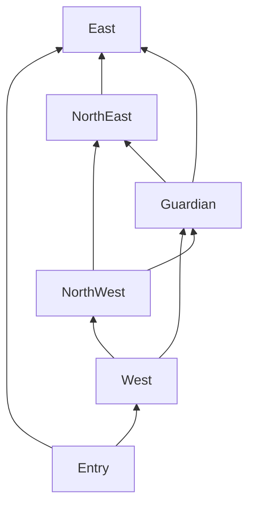

# Levels, objectives and encounter structure

**First-level encounter override:** the first playable expedition uses normal grunt, runner and bruiser slimes with King Slime as guardian. The older Verdant/Realm 1 Rootbound Colossus, elemental affinity, pursuer and ranged encounter proposals below are deferred expanded alternatives, not simultaneous requirements or a second first-level boss. Apply the normal-slime scope in document 15 before authoring encounters.

**Decision precedence:** [Alignment review and open conflicts](13-review-record.md#alignment-review--28-september-2026) supersedes older conflicting proposals below, especially XP/mana, infection/Big and roster counting.

**Development context (28 September):** use [development order](15-development-order.md) for implementation sequencing. Existing gameplay remains the foundation; these target-design tables do not require rebuilding or withholding existing spells. Numeric defaults and unresolved choices remain proposals. Preparation/XP/mana policy and recent spell-identity notes must be reconciled before dependent changes; the first keyword increment retains existing progression.

**Tutorial plus four realms is proposed campaign scope.** Four ley lines and 20-minute extraction are confirmed. Geometry, rewards, timings and enemies below are tuning proposals, not tested maps.

## Authored graph with procedural connections

Use a **6000 × 6000 wu objective region**. Normalized anchors: entry (0.50, 0.90), west ley (0.20, 0.65), northwest ley (0.25, 0.25), northeast ley (0.75, 0.25), east ley (0.80, 0.65), guardian (0.50, 0.45). Named sites map clockwise W/NW/NE/E. Anchors jitter ±160 wu except entry/guardian. Main loop connects entry → W → NW → NE → E → entry. Two cross-links connect W → guardian → E and NW → guardian → NE. Guardian ground is traversable before activation.

Paths meander through modules. Target main circuit length is 28,000–36,000 wu, about 2:36–3:20 of uncontested walking at 180 wu/s; optional detours bring exploration toward 3–4 minutes. The straight anchor loop is about 12,500 wu, so this asks for a 2.2–2.9× detour factor. Record that ratio as a blockout metric; it is a feasibility hypothesis, not proven good pacing. Validate actual navigable path length, not straight-line anchor distance. If module placement creates artificial winding merely to meet the target, shorten the target rather than making the world tedious.

Primary route width≥144 wu (six player diameters), short optional path≥72 wu. Ley arenas minimum 360 × 300 wu with two exits≥144 wu. Guardian arena 560 × 440 wu with clear perimeter. Every site has an outer staging pocket and visible approach marker. Decorative tree canopy may overlap paths, trunk collision may not. No jump, special spell, elemental damage or movement upgrade is required to traverse any mandatory route.

Production budget per realm:12 connective module layouts, four authored ley arenas, one entry, one guardian arena and four optional landmarks. Geometry can be reused across realms when materials and encounter purpose change. Each connector has two or more sockets, guaranteed navigable lanes, obstacle exclusion masks, reward sockets and enemy-entry sockets. Seed chooses compatible modules, rotates scenery where appropriate, then validates reachability after collision placement. Text/glyph landmarks are not randomly mirrored.

Generation passes: reserve anchors → connect graph → place traversable modules → add alternate loops → place low-risk entry → fill obstacle clusters → place encounters/rewards in approved sockets → flood-fill and width-test → validate objective travel budget → serialize seed + generator version. Retry up to 20 seeds, then use an authored fallback layout; never load an invalid map hoping the player has the right spell.

Tree/bush clusters use 3–7 members around a center, spacing by actual trunk radii, visual scale 0.88–1.12, weighted clearings. No equidistant infinite lattice. Decorative canopy fades when covering player or hostile action; enemies do not become transparent. Scenery scale and trunk collision remain independent but authored together. Infinite decorative terrain outside the objective region is permitted only as a visual extension; a visible mist boundary redirects before the player loses the route. This bounded interpretation needs D11 review.

## Tutorial: Broken Observatory

Authored 8–12 min, no 20-minute deadline, checkpointed courtyards. All instructions self-paced; danger begins after acknowledgement. Repeating a lesson does not regrant rewards.

| Step | Encounter and interaction | Grant | Completion evidence |
|---|---|---|---|
|1: A spark|Stationary target, then three 40 HP slow slimes at distance 220; movement corridor |Bolt initially|Land a visible contact and move around an enemy; failure retries locally|
|2: Pages wake|Collect 40 fixed mana, reorder demonstration shows future slot |Life in page 2|Activate page 2; heal an optional training wound or observe a damaged practice ally panel without forced self-harm|
|3: A fan of ice|Five 40 HP targets across 90°, two moving; safe side pocket |Ice Blast|See shard contact and slow; no damage on untouched target|
|4: Strike a group|Three 60 HP slimes inside 80 radius, another outside |Lightning|Clear cluster; outer target unharmed; learn ground boundary|
|5: Words change shape|Two lanes, Big comparison preview, spaced targets |Big|Cast Big Bolt; explain size change in one sentence; no WPM grading|
|6: A discovered connection|Activate all four tutorial pages; show derived spells |Life Bolt, Lightning Bolt recipes|Cast one chain and collect one healing seed; originals still castable|
|7: First ley|Two waves of 4 slimes, then type `attune` (6 letters) at altar |Practice ritual acknowledgement only|Complete under forgiving pressure; typing errors can be corrected|
|8: Practice guardian|300 HP stone dummy guardian, one 0.8 s telegraphed sweep then 2 s rest |Tutorial completion and Verdant Ruins access|Defeat, see reward/extract, reorder a page in preparation|

No tutorial guardian damage over 10/hit; training death restores checkpoint, retains lesson progress. Optional skip goes to a clear summary and grants the same tutorial knowledge. Skip is not a secret handicap. Test that four taught bases and two derived combinations are understood separately.

## Common ley challenge rules

Approach and interact once to preview reward/challenge. Starting locks only that site's encounter budget; player may leave through exits. Ambient peak spawns pause within 500 wu. Each challenge has 2–3 waves, explicit remaining enemy markers only for the active challenge, and a final ritual. Killing a wave never requires finding a stray enemy beyond the arena: challenge enemies leash to 450 wu and indicators identify stragglers.

Ritual requires typing its one canonical word within 6 unpaused real seconds while in altar range 60 wu. Standard per-cast assist applies once, not perletter. Taking damage does not delete text; moving out cancels and retains attempt budget rules. Failure restarts that ritual after 3 s, with at most two nuisance grunts, not the whole encounter. Completed waves remain cleared this attempt. A successful ritual awards knowledge and 30 mana, then 12 s low-pressure reward window once immediate threats are resolved. Optional five-hard-word mastery challenge is separate and can be declined.

## Realm 1: Verdant Ruins

Identity: mossy courts, broad tree pockets, pale broken aqueducts. Tactical lesson: short control creates room for sustained effects. Affinity proposal: plague × 1.15, earth × 0.85, all other damage × 1.0; no healing penalty. Baseline threat multiplier 1.0. Ranged enemies only after 10:00. Target first completion 12–18 min; 20-minute survival also unlocks realm 2.

| Site/anchor | Authored challenge | Knowledge bundle | Ritual |
|---|---|---|---|
|Broken Gate/W|2 waves:6 grunts + 4 swarmers; then 8 grunts + 2 runners; open courtyard with flank loop|Cinder Field, Firewalk; Powerful|`kindle`|
|Root Circle/NW|2 waves:2 brutes + 6 grunts; then 1 pursuer + 8 swarmers; safe staging crescent|Seeker; Seeking|`awaken`|
|Fallen Aqueduct/NE|3 waves:6 grunts; 4 runners + 1 brute; 2 pursuers + 4 grunts; two wide lanes|Rune Trap, Plague Seed; Lasting|`entwine`|
|Quiet Orchard/E|2 waves:8 swarmers + 2 runners; 2 brutes + 6 grunts; no healing required to clear|Regeneration; Repulsing|`restore`|

Guardian **Rootbound Colossus**:1800 HP, contact 12, radius 42, speed 65. Pattern A 0.8 s warning → 120° sweep reach 100 for 18 damage → 1.8 s recovery. B three ground root lines width 20, length 240, 0.9 s warning, 20 damage; then 2.2 s recovery. C summon 6 grunts (once per 40 s, cap 6 guardian adds). Below 50% alternate A/B faster recovery 1.5 s, never overlap active attacks. No new phase immunity. Reward: Earth Shield. Reward and extraction flow in progression.

## Realm 2: Cinder Foundry

Two parallel furnace lanes with cross-links and cooling courts. Fire × 0.85, water/ice × 1.15, other 1.0. Baseline 1.15; ranged after 8:00 because this is later progression, but first 2 min still melee. Hazards alternate on an 8 s cycle:1 s outlined warning, 2 s hot, 5 s safe; 8 damage/s, no frame-rate dependence. At least one full-width safe route always exists.

| Site/anchor | Challenge | Knowledge bundle | Ritual |
|---|---|---|---|
|Bellows/W|2 waves:4 runners + 6 grunts; 3 brutes + 4 swarmers across alternating lanes|Ember Lance, Cross Blade; Delayed|`temper`|
|Kiln/NW|3 waves:8 grunts; 2 pursuers + 4 runners; 3 brutes + 6 grunts, central cooling pocket|Fire Bolt; Fiery|`ignite`|
|Forge/NE|2 waves:2 brutes + 6 runners; 1 elite brute + 6 grunts, clear 1.8 s attack recoveries|Firestorm; Charged|`conjure`|
|Ash Court/E|3 waves:8 swarmers; 8 grunts + 2 runners; 2 brutes + 2 pursuers|Summon Golem; Earthen|`embody`|

Guardian **Kiln Regent**:2400 HP, radius 44, speed 60, contact 14. A 1.0 s cone warning → three fire pulses over 0.6 s, 10 each, one hit/player perattack → 2.0 s cooldown. B marks three 60 radius furnaces 0.9 s before 18 damage burst → 2.5 s rest. C charging walk 120 wu/s for 1.5 s after 0.8 s warning, 16 contact, then 2 s exhaust. Below 50% B usesfour disks with guaranteed two escape corridors. Adds 4 runners every 45 s, max 4. Reward: Meteor Shower.

## Realm 3: Stormwater Cloister

Ring courts around water channels; bridges≥180 wu, no projectile knockback into instant death. Lightning × 0.85, earth × 1.15, other 1.0. Baseline 1.30; ranged after 6:00, capped as combat chapter. Water is background unless marked as a hazard; decorative puddles never secretly slow.

| Site/anchor | Challenge | Knowledge bundle | Ritual |
|---|---|---|---|
|Rain Court/W|2 waves:8 runners + 4 grunts; 3 pursuers + 6 swarmers, wide flanking routes|Wave, Water Jet; Swift|`surge`|
|Forked Arcade/NW|3 waves:10 grunts; 3 brutes + 4 runners; 2 pursuers + 8 grunts|Frost Nova; Icy|`crystallize`|
|Floodgate/NE|3 staggered waves:8 swarmers each, then 2 brutes; each wave can be controlled without a specific element|Thunderwave; Repeating|`resonate`|
|Mirror Pool/E|2 waves:4 pursuers + 4 grunts; 2 casters + 6 runners; caster variant allowed only after 6:00, otherwise 2 brutes|Frost Ray; Venomous|`reflect`|

Guardian **Tempest Cantor**:2800 HP, radius 36, speed 85, contact 14. A two crossing lanes width 24, warning 1.0 s → 22 damage → 2 s rest. B 0.8 s warning → six slow radial orbs speed 100, 10 damage, expire 3 s → 1.8 s rest. C four 80 radius lightning marks 0.7 s apart, warning 0.8, 18 damage; cannot overlap all escape lanes. Below 50% orbs 8, still one pattern active. Reward: Earthquake.

## Realm 4: Astral Ossuary

Concentric rings and diagonal shortcuts; geometric silhouettes on quiet dark stone. Arcane × 0.85, spirit × 1.15, other 1.0. Baseline 1.45; ranged after 5:00. This is a composition exam, not a requirement to own every keyword. No enemy immune to a damage school.

| Site/anchor | Challenge | Knowledge bundle | Ritual |
|---|---|---|---|
|Bone Causeway/W|3 waves:8 grunts + 4 runners; 3 brutes + 6 swarmers; 2 pursuers + 2 casters (or brutes before 5:00)|Arcane Orbit, Focus Ray; Duplicating|`multiply`|
|Spore Vault/NW|2 staggered packs of 12 mixed grunts/swarmers with 3 s gap; then 2 brutes|Grasping Hand; keyword practice reward only|`ensnare`|
|Lunar Court/NE|2 waves:3 pursuers + 6 grunts; 3 brutes + 3 casters (or brutes before 5:00), three safe pockets|Moonfall; keyword practice reward only|`illuminate`|
|Meridian/E|3 waves:10 runners; 2 elite grunts + 6 swarmers; 3 brutes + 2 pursuers + 2 casters (substitute early)|Mana Storm; keyword practice reward only|`transcend`|

Keyword practice reward means mastery stamp plus ordinary 30 mana, not a duplicate stat boost. This realm tests previously discovered words, up to fourteen, rather than adding synonyms. Survival extraction can skip earlier rewards; every challenge must remain clearable with the tutorial vocabulary and prepared damage spells.

Guardian **The Unwritten**:3400 HP, radius 38, speed 80, contact 16. Cycles three previously taught patterns: lane strike warning 1 s, 24 damage; advancing fan warning 0.8 s, 18 damage; four ground disks warning 0.9 s, 22 damage. Each has 2 s recovery; at 50% insert a 3 s vulnerable quiet beat then use shorter 1.6 s rests. No copied player casts, input theft, untelegraphed movement or novel immunity. Adds 4 grunts + 2 runners every 45 s, max 6. Reward: Yggdrasil. Final campaign result returns to preparation with replay/mastery options, not an endless battle.

## Timing and difficulty rules

Sites are not gated to exact minute marks. Challenge waves use the current time HP multiplier multiplied by realm factor, but their listed counts are fixed. A wave spawns over 2 s from authored sockets outside immediate player collision, with 0.6 s arrival cues. Next wave waits until prior wave defeated plus 3 s. Objectives should take 60–120 s each including ritual; four sites 4–8 min plus travel/combat detours should make 12–17 min guardian attempts plausible. Measure this; four sites in 4 min may reveal undertuned encounters rather than justify hidden waits.

Elites at 4:00, 8:00, 12:00, 16:00 are **patrol opportunities**, not bosses. If in a ritual/boss, defer patrol until that encounter resolves; after 19:00 discard deferred patrol instead of surprising extraction. Each patrol is one elite plus 4 escorts, no special reward required for progression. Ordinary ambient pacing and boss adds never double-spawn unrestricted waves.

Guardian stats are realm-fixed and do not multiply by time HP; early completion already requires efficiency. Boss phases remain readable at all arrival times. Boss defeat reward cannot be farmed repeatedly in the same expedition. Full 20-minute extraction remains valid if player chooses not to summon.

## Variant gate precedence

All variant introduction times apply to ambient and authored encounters. Before 2:00, replace Dart with Swarmer; before 3:00, replace Pursuer with two Swarmers; before 4:00, use Rootback instead of Crusher; before 6:00, use Rootback instead of Brood. A generic runner slot means Swarmer until Dart unlocks; a generic brute slot means Rootback until other variants unlock. Ranged substitutions use the realm-specific time. These substitutions keep objective routes open without introducing attacks before their tutorial/timing gate. Tutorial enemies use their explicit authored rules instead.

## Deferred boss idea — The Disruptor (2026-09-28)

**Player concept, not implemented and not assigned to a current boss slot or realm.** The Disruptor corrupts spell incantations: the required string keeps the same length, but its letters are scrambled/randomized. The intended encounter twists the game's typing mechanic rather than just increasing enemy health. Casting still invokes the underlying owned spell; it does not unlock otherwise unavailable magic.

Preserve all proposed timing alternatives: scramble once for the encounter, periodically, or after each cast. The user has not selected one. Also unresolved: shuffle the existing letters versus replace them, affect one spell versus the whole available kit, treatment of spaces/punctuation, whether the corruption expires before the boss dies, and interaction with pause/menus and typed spell selection.

Suggested first test, not a user decision: show the corrupted incantation beside the recognizable spell name/icon, keep that string stable once the player begins typing, and change it only after cast completion or a clearly signaled phase. Keep randomization deterministic for a given encounter state and restore normal incantations when the effect ends. Preserve typed length and current-run ownership gates. The encounter should read as hostile magical interference; whether arbitrary strings remain enjoyable rather than merely error-prone requires playtesting. No damage, frequency, countermeasure or accessibility rule is selected yet.
