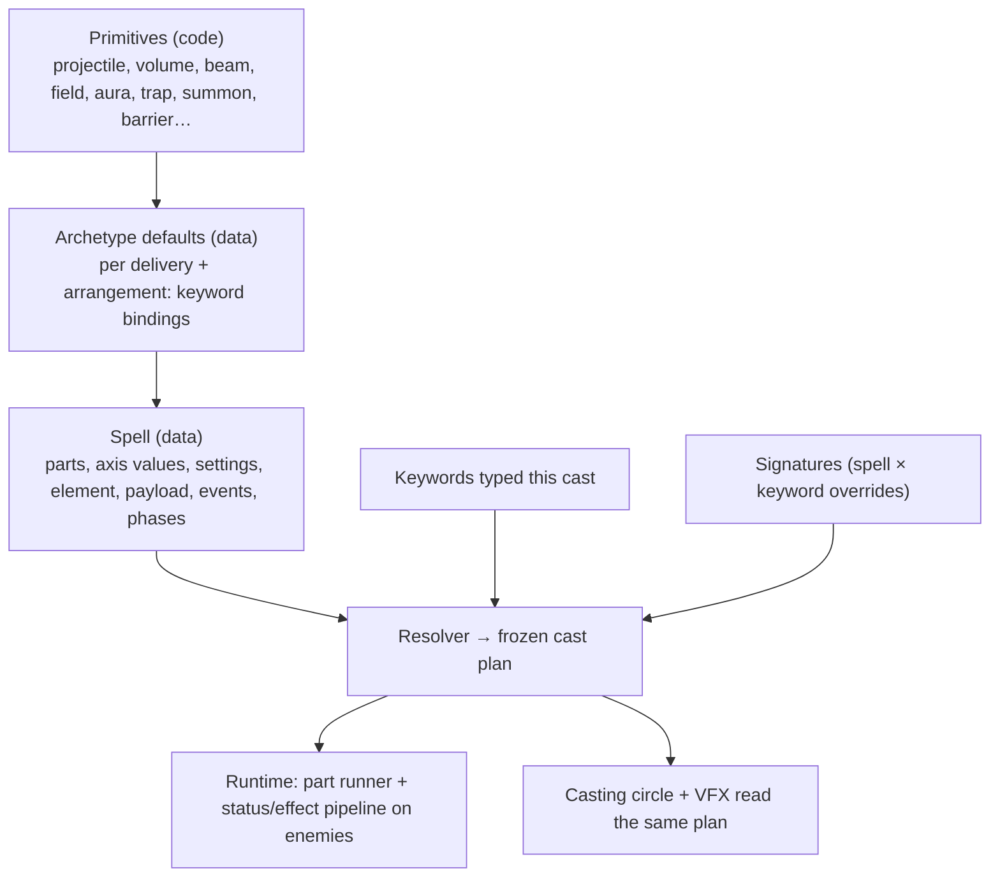
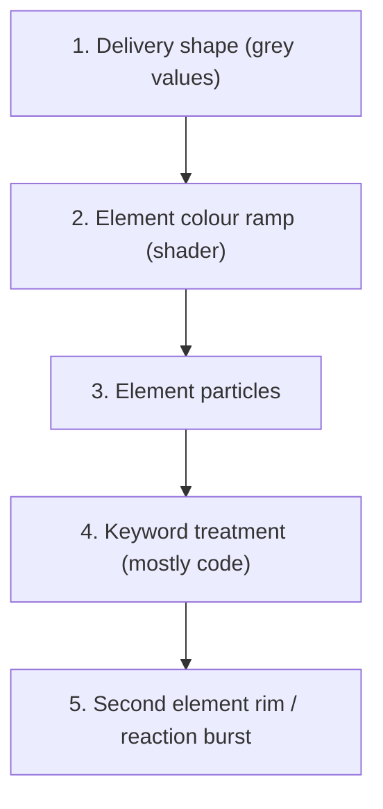

# Spell system rewrite: spells, keywords, effects and art

**Draft v0.1 · 5 October 2026 · design for review, no runtime change yet**

This document defines the spell system we are rebuilding toward: what a spell is, what each keyword does, how effects such as damage types, statuses, knockback and gravity work, how enemies must behave to support them, how every current spell maps onto the new system, a complete specification of every approved idea from [doc 17](17-element-spell-ideas.md), the full art list, starting numbers, and the order of the rewrite.

It builds on the component vocabulary in [doc 14](14-spell-system-reference.md) and the [element × family matrix](16-element-family-matrix.md). Where this document conflicts with older proposals in docs 04 and 14, this document is the newer decision record; numbers marked *proposed* are starting points to tune.

## Contents

- [1. What we are trying to do](#1-what-we-are-trying-to-do)
- [2. Decisions recorded in this pass](#2-decisions-recorded-in-this-pass)
- [3. Architecture](#3-architecture)
- [4. Spell definition format](#4-spell-definition-format)
- [5. Effects: payload, damage, forces and statuses](#5-effects-payload-damage-forces-and-statuses)
- [6. Elements](#6-elements)
- [7. What enemies need to support this](#7-what-enemies-need-to-support-this)
- [8. Keywords](#8-keywords)
- [9. Starting numbers](#9-starting-numbers)
- [10. Custom spells](#10-custom-spells)
- [11. Current spells in the new system](#11-current-spells-in-the-new-system)
- [12. Approved design spells, specified](#12-approved-design-spells-specified)
- [13. Art needed](#13-art-needed)
- [14. Rewrite plan](#14-rewrite-plan)
- [15. Open decisions](#15-open-decisions)
- [Appendix A: fit check of every idea in doc 16](#appendix-a-fit-check-of-every-idea-in-doc-16)
- [Appendix B: engine work the format needs](#appendix-b-engine-work-the-format-needs)

## 1. What we are trying to do

A cool spell list with distinct fantasies. Every spell can be modified by words, and modified spells feel like new spells: `triple ember spear`, `triple mega icy ember spear`. Combinations come mostly for free from shared rules; the best pairings get hand-made signatures.

Principles:

1. **Fantasy first.** A spell may be weak if it fulfils its fantasy; it does not have to be balanced into sameness.
2. **Length is the price.** Longer incantations must buy more. Every keyword adds letters and has a cost of its own.
3. **One promise per keyword.** A word always means the same thing to the player (homing always finds enemies for you). How it expresses that may differ per spell.
4. **Defaults, then signatures.** Every spell × keyword pair works through defaults; hand-made signatures exist only where the default is dull.
5. **Readable.** What you see is what hits. Targeting is predictable (nearest enemy first). A rejected word cracks its rune red; nothing fails silently.
6. **Bounded.** Every cast has hard limits on depth, spawns and hits per target, so no combination breaks a frame.
7. **No compulsory hard counters.** Resistances steer choices, never force them.
8. **Magic is learned, not granted.** A wizard is a scholar who has spent years learning ancient knowledge of natural forces: fire, cold, lightning, stone and steel, rot, growth, and raw mana. No gods, faith or divine power. Names, statuses and art stay grounded in those forces; every new word is something the wizard *knows*, which is why typing it is the spell.

### 1.1 A spell's name is not its type

**Names are fantasy. Types are mechanics.** A spell is named for what it should feel like; it is built from whatever parts deliver that feeling. The system never reads the name or the matrix column, only the parts.

| Player name | Sounds like | Actually built as (type) |
|---|---|---|
| Fire Wave | a wave | could be `volume · ring · expanding` (a nova) or `volume · cone` (a blast); the designer picks whichever fits the fantasy |
| Ice Blast | an area burst | `projectile · fan` of shards |
| Tsunami | a wave | `volume · rect · travelling` from behind the caster |
| Lightning | a bolt | `volume · disk` at the target, plus a chain |
| Black Hole | a hole | `field · disk` with a pull force |
| Ember Spear | a spear | `projectile · single · body` with a trailing field |

Three separate things, never mixed:

1. **Name**: what the player types and sees. Chosen for fantasy.
2. **Matrix column** (Bolt, Ball, Spear, Ray, Blast, Nova, Wall…): where the idea is filed in [doc 16](16-element-family-matrix.md) for browsing. Also fantasy. It does not decide behaviour.
3. **Type**: the parts and axis values (delivery, arrangement, geometry, motion…). This alone decides behaviour, keyword bindings and art.

Keyword rules bind to **type**. Two spells in the same matrix column can behave completely differently with the same keyword; two spells with different names and columns but the same type behave the same.

## 2. Decisions recorded in this pass

- Spells are built from **parts**; each part picks one value per **axis**. Spells link parts through **events** and change behaviour over time through **phases**.
- Keywords bind to **axis values**, not to individual spells. Spells override only for signatures or rejections.
- **Name ≠ type** (section 1.1). The matrix column (Blast, Nova, Spear…) is only a browsing label. **Type** (delivery first) decides keyword behaviour. Ice Blast (projectile fan) and a flamethrower (volume cone) share a matrix column but bind keywords differently.
- **Shield and restoration are not deliveries.** Healing, absorb and block are payloads; Regeneration and Earth Shield are auras on the caster.
- **Creature is renamed `summon`.** Player-facing summon words stay spell names (Golem, Raise Dead).
- **Aura** is a delivery: a persistent area anchored to an entity. Field is the same anchored to the ground; they share code.
- **Pattern is split** into Arrangement (where copies sit) and Release (when they go).
- **Effects are payload, not events.** Events decide when new parts appear; payload decides what happens to each target.
- **All statuses go through one path** into one status component per enemy, with per-status stacking rules and per-enemy resistance profiles.
- **Damage type lives on each damage entry**, so one hit can carry several types. A spell's element is its theme and default type.
- **Every damaging spell splits raw + its own element:** about 75–80% `raw` and 20–25% elemental on direct hits. DoTs (burn, poison, bleed) are fully elemental. Raw damage is reduced only by armour; elemental damage only by that element's resistance.
- **Element keywords add, never convert:** extra elemental damage (+35% of the base hit, tuning range 25–50%) plus that element's status, applied to **every damaging part** of the spell, including its fields and trails. `icy ember spear`: the spear hits for raw + fire + ice and chills; its burning strip also slows.
- **Life, not Holy.** The seventh element is Life: druidic magic of vines, roots, flowers, plants and soil that heals. No holy or faith magic (principle 8); RADIANT is reserved for a possible light school grounded in the sun, not in gods.
- **Seven elements, one per school:** Arcane, Fire, Water/Ice, Storm, Earth/Steel, Plague/Death, Life. Merged schools share one damage type, signature status and resistance (6.1).
- **Fusion and reactions, both** (section 6.4). One spell with two elements **fuses**: everything coexists. Different casts react only through a short list of five reactions; most pairs simply coexist. Damage mixing never interacts.
- **DoT rule:** getting hit again stacks damage and duration, no caps. Burn: every fire hit adds its own 1.5 s burn, all ticking together; bleed fills a meter that bursts into a hemorrhage; poison ticks slowly, ramps, weakens and lasts longest; chill stacks to frozen (5.3).
- **Custom spells** may have their own code but must still honour the keyword contract (section 10). No current spell needs to be custom.
- **Spear, not Lance.** The thrown fire weapon is a spear everywhere, including internal ids (section 11). **Lance** is reserved for a different future spell, probably a melee thrust (filed near Slash in doc 16).
- **Homing Bolt** is a homing signature on Bolt, not a new spell (section 8).

## 3. Architecture



| Layer | Owns | Grows by |
|---|---|---|
| Primitive | One mechanical behaviour, registered by id | Code, rarely |
| Archetype defaults | Standard keyword binding per delivery and arrangement | Data |
| Spell | The fantasy: parts, settings, element, events, phases, art | Data |
| Keyword | One promise, default operation per axis value, cost | Data |
| Signature | A spell's own interpretation of one keyword | Data, occasionally a small script |

**Resolution order** (also the stacking order): primitive defaults → spell → keyword defaults for each part's axis values → spell signatures → caster stats (rank, passives) → limits → frozen cast plan. Within keywords: count words, then tier words (Mega/Omega), then behaviour words, then element words. Multipliers apply as flat additions, then summed percentage increases, then each multiplier in turn.

**Word order is free.** `icy triple ember spear` and `triple icy ember spear` resolve the same. The parser finds the longest known spell name and treats the remaining known words as keywords. Duplicate keywords are rejected unless the keyword says it stacks.

## 4. Spell definition format

A spell is one or more **parts**. The first part is the root, created by the cast. Other parts are created by events.

### 4.1 Axes

| Axis | Question | Values | Settings |
|---|---|---|---|
| Origin | Where does it start? | `caster`, `target`, `ground_point`, `behind_caster`, `parent` | offset, lock on release |
| Delivery | What exists in the world? | `projectile`, `volume`, `beam`, `field`, `aura`, `trap`, `summon`, `barrier`, `collectible`, `self`, `global` | per delivery, below |
| Arrangement | Where do the copies sit? | `single`, `fan`, `ring`, `line`, `grid`, `scatter` | count, spread angle, spacing, radius |
| Release | When do they go? | `together`, `staggered`, `triggered`, `on_recast` | interval, trigger condition, range |
| Geometry | What shape hits? | `body`, `disk`, `cone`, `line`, `rect`, `ring`, `arc`, `trail` | radius, angle, length, width, thickness |
| Aim | Where does it face? | `release_direction`, `nearest`, `track_target`, `sweep`, `caster_facing`, `fixed` | turn rate, sweep arc and speed, target assignment across copies (`same`, `distinct`, `nearest_each`) |
| Motion | How does it move? | `none`, `straight`, `guided`, `spiral`, `orbit`, `return`, `follow`, `lob`, `fall`, `wander`, `anchored` | speed, range, turn rate, acquisition range, orbit radius |
| Propagation | How does an area switch on? | `instant`, `expanding`, `sweep`, `travelling` | front speed, thickness |
| Timing | When does it apply payload? | `once`, `periodic`, `pulses`, `channel`, `on_enter` | duration, tick interval, pulse count, per-target rehit interval |
| Payload | What happens to each target? | list of effects (section 5) | per effect |
| Recipients | Who is affected? | `enemies`, `self`, `allies`, `summons`, `pickups`, `corpses` | per payload entry |
| Events | What does it create? | `on_hit`, `on_first_hit`, `on_kill`, `on_travel`, `on_tick`, `on_expire`, `on_land`, `on_block`, `on_reaction`, owner and afflicted events (4.3) | child part or spell reference, inherited power |
| Phases | How does it change over time? | ordered list (4.4) | per phase |
| Limits | How much can exist? | | max active, at-cap rule, pierce, chain, hit scope, lifetime |

Delivery-specific settings:

| Delivery | Required settings |
|---|---|
| projectile | body radius, contact policy (stop / pierce N / unlimited), rehit interval if it survives contact |
| volume | geometry, propagation, active window |
| beam | length, half-width, occlusion policy, max targets per sample |
| field | geometry, duration, tick interval, anchor (ground) |
| aura | geometry, duration, tick interval, anchor entity, lost-anchor policy |
| trap | trigger shape, arming time, trigger filter, charges |
| summon | health, body, movement, perception range, behaviour preset (`chase`, `guard`, `turret`, `decoy`, `taunt`), attack (child part or spell reference), lifetime |
| barrier | shape, health, collision (`blocks_enemies`, `blocks_projectiles`, `passable`), destructible, reflect fraction |
| collectible | body, pickup filter, expiry, attraction |
| self | applies payload to the caster instantly |
| global | applies payload to every eligible recipient on screen |

### 4.2 Arrangement and copies

Copies made by arrangement or count keywords may vary by index: colour, element, angle offset, delay (`per_copy`). This is how Prism Ray's seven rays each get a colour. Copies share the cast's hit record unless the part says otherwise.

### 4.3 Event sources

Most events come from the part itself. Three other sources are needed:

| Source | Events | Used by |
|---|---|---|
| Part | `on_hit`, `on_first_hit`, `on_kill`, `on_travel`, `on_tick`, `on_expire`, `on_land` | most spells |
| Owner (the caster) | `on_caster_hit`, `on_block`, `on_caster_travel`, `on_cast` | Earth Shield, Fire Shield, Firewalk, Muck, flower trail |
| Afflicted (an enemy carrying this cast's status) | `on_afflicted_tick`, `on_afflicted_death`, `on_afflicted_hit` | Plague Seed, Soul Bloom, Raise Dead, Lightning rod |
| Reaction | `on_reaction` (section 6.3) | element reactions |

Children inherit the parent's position, direction, target, generation number, cast id (for the hit record) and a share of its power (`power`, default 1.0).

**Spell references:** a part or summon attack may cast a whole spell by id, including one from the player's kit at the player's rank (`"cast": "ember_spear"`).

### 4.4 Phases

A part can move through phases. Each phase may set motion, aim, payload multiplier, active events and visuals, and ends when its `until` condition is met: a time, `released`, `enemy_in_range`, `hit`, `host_died`, `recast`, `landed`.

```json
{
  "phases": [
    { "name": "out", "motion": { "type": "straight", "speed": 500 }, "until": { "distance": 350 } },
    { "name": "linger", "motion": { "type": "none" }, "payload_scale": 0.5, "timing": { "type": "periodic", "interval": 0.3 }, "until": { "time": 0.9 } },
    { "name": "return", "motion": { "type": "guided", "target": "caster", "speed": 650 }, "payload_scale": 2.0, "until": "caught" }
  ]
}
```

That is Cross Blade.

`matrix_column` in spell data is a browsing label for docs and the spellbook only. Nothing in the engine reads it.

### 4.5 Limits

| Limit | Proposed default | Purpose |
|---|---|---|
| Link depth (generations of child parts) | 3 | No infinite chains |
| Parts spawned per cast | 48 | Frame budget |
| Hits per enemy per cast | defined by `hit_scope`: `cast`, `part`, `copy`, `pulse` | One combo cannot hit the same enemy dozens of times |
| Active parts per spell | per spell `max_active` with an at-cap rule (`replace_oldest`, `extend`, `refuse`) | Persistent spells stay readable |
| Status types per enemy | 8 | Readability and cost |

### 4.6 Full example: Ember Spear

```json
{
  "id": "ember_spear",
  "name": "Ember Spear",
  "incantation": "ember spear",
  "matrix_column": "spear",
  "element": "fire",
  "parts": {
    "spear": {
      "origin": "caster",
      "delivery": "projectile",
      "arrangement": { "type": "single" },
      "geometry": { "type": "body", "radius": 24 },
      "aim": { "type": "nearest", "tilt_to_catch_line": true },
      "motion": { "type": "straight", "speed": 1050, "range": 1050 },
      "timing": { "type": "once" },
      "payload": [ { "type": "damage", "amount": 74, "damage_type": "raw" }, { "type": "damage", "amount": 22, "damage_type": "fire" } ],
      "limits": { "pierce": "unlimited", "hit_scope": "cast" },
      "events": { "on_travel": { "part": "fire_strip", "power": 1.0 } }
    },
    "fire_strip": {
      "origin": "parent",
      "delivery": "field",
      "geometry": { "type": "trail", "width_from_parent": true },
      "timing": { "type": "periodic", "interval": 0.5, "duration": 1.5 },
      "payload": [ { "type": "status", "status": "burn", "strength_of_hit": 0.12 } ],
      "limits": { "max_active": 3 }
    }
  },
  "bindings": { "size": [ "spear.geometry.radius", "fire_strip.geometry.width" ] }
}
```

## 5. Effects: payload, damage, forces and statuses

Events decide **when** new parts appear. Payload decides **what happens** to each recipient a part touches. Knockback, pull, gravity, bleed and damage types are all payload.

### 5.1 Effect types

| Effect | Fields | Notes |
|---|---|---|
| `damage` | amount, damage type (`raw` or an element) | Several entries on one hit = several damage types (70 fire + 30 ice). Each resolves separately against resistance; shown as one number coloured by the larger share. |
| `impulse` | direction mode, force, falloff | One shove on contact (knockback). Divided by enemy weight. |
| `force` | direction mode, strength per second, falloff with distance, max speed | Continuous while inside a field or aura (gravity, pull, wind, swirl). Summed per enemy each frame. |
| `status` | status id, strength (or share of the hit), duration override | Everything ongoing: burn, bleed, poison, chill, root, stun, weaken, vulnerable, taunt, transform, buffs (section 5.3). |
| `heal` | amount or rate | Friendly recipients only. Never negative damage. |
| `absorb` | capacity, duration | Damage pool on the recipient. |
| `block` | charges | Each charge cancels one whole hit and fires `on_block`. |
| `cleanse` | status kinds removed | Removes statuses (friendly or hostile, by recipient). |
| `attract` | strength | Pulls pickups (XP magnet). |

**Direction modes** (impulse and force): `away_from_source`, `toward_point`, `toward_caster`, `along_travel`, `lateral`, `tangential` (swirl), `self` (moves the caster: dash).

### 5.2 Damage order

base amount → caster power (rank, keywords, passives, ley sites) → target modifiers (vulnerable, weaken) → **armour for `raw`, resistance for each element** → absorb and block → health. Each damage entry goes through this separately; the results are summed into one number.

### 5.3 Status system

Every status from every source goes through `apply_effect` into **one status component per enemy** (and one on the player), which runs all of that entity's statuses in a single loop.

A status is data:

| Field | Meaning |
|---|---|
| element | element tag, used for reactions and resistance |
| kind | `dot`, `control`, `modifier`, `transform`, `buff` |
| damage type, tick | for DoTs: what each tick deals and how often |
| duration | default length |
| reapply | how a new application combines (bleed and poison add damage and duration; burn adds a separate instance) |
| threshold | what happens when a meter or stack count fills, if any (chill → frozen at 5 stacks; bleed meter → hemorrhage) |
| class | `soft_cc` or `hard_cc` for control resistance |
| visual | body overlay and icon ids (section 13) |


**Base rule for every damage-over-time status: getting hit again stacks it.** More applications mean more damage (bleed and poison add damage and duration; burn adds separate short burns). No caps. That is just how effects work; each DoT then has its own identity on top:

| Status | Identity | How it behaves |
|---|---|---|
| **Burn** (Fire) | Pour it on. The fastest DoT. | **Every fire hit starts its own burn** that lasts 1.5 s. All active burns tick at once, so more fire hits means more burns burning together. No pool, no timer resets, no cap. |
| **Bleed** (Earth/Steel) | Build-up to a big payoff, like blood loss in Elden Ring. | Each hit adds a little bleed damage over time **and fills a bleed meter**. When the meter fills, the enemy **Hemorrhages**: a burst of heavy damage based on its maximum health, then the meter empties. The meter drains slowly if you stop hitting. |
| **Poison** (Plague/Death) | Slow rot that saps the enemy. The most total damage of any DoT, over the longest time. | Long, slow ticks that **get worse the longer it stays on**; new poison stacks more damage and duration without resetting that ramp. A poisoned enemy is **weakened** (deals less damage). Does not spread (spreading belongs to Plague Seed's infection). |
| **Chill** (Water/Ice) | Lock them down. Control, not damage. | Each hit deals a small **frostbite** hit and adds one stack; chilled enemies are **slowed** more with every stack. At 5 stacks the enemy becomes **Frozen** (separate status); chill clears and it cannot be frozen again for a short time. |

Other rules:

- **Different statuses always coexist.** Burn, bleed and poison all tick at once.
- **Each application remembers its source spell** for style credit and kill attribution.
- **Slows don't multiply into a lock:** strongest slow plus 10% of each other slow, capped at 70%.
- **Hard control** (frozen, stunned, rooted, transform): bosses and elites have diminishing returns; each application shortens the next by 50% for 4 seconds.

### 5.4 Status catalogue (proposed)

| Status | Element | Kind | Effect |
|---|---|---|---|
| burn | Fire | dot | Each fire hit adds its own 1.5 s burn; all tick together |
| bleed | Earth/Steel | dot + build-up | Small damage over time; fills a meter that triggers hemorrhage |
| hemorrhage | Earth/Steel | burst | Heavy burst based on max health when the bleed meter fills |
| poison | Plague/Death | dot + modifier | Long slow ticks that ramp; target is weakened while poisoned |
| infection | Plague/Death | dot + spread | Plague Seed's host-to-host transfer (section 12) |
| chilled | Water/Ice | control (soft) | Slow per stack, frostbite hit per stack; 5 stacks → frozen |
| frozen | Water/Ice | control (hard) | Cannot move or attack; ends early if shattered or thawed |
| shocked | Storm | control (soft) | Brief stagger; **arcs to one nearby enemy** on application |
| entangled | Life | control (soft) | Vines slow the enemy; enough entangle builds to a brief root |
| rooted | Earth/Steel, Life | control (hard) | Cannot move; can still attack |
| stunned | Storm, Earth/Steel | control (hard) | Cannot move or attack |
| weakened | Plague/Death | modifier | Deals less damage |
| vulnerable | Arcane | modifier | Takes more damage |
| taunted | none | control | Attacks the taunter instead of the player |
| transformed | Arcane | transform | Replaced by a harmless form (Polymorph) |
| marked | none | modifier | Target for other parts (Lightning rod, homing) |
| haste / power / ward | various | buff (friendly) | Player buffs from restoration and auras |
| invulnerable | Arcane | buff (friendly) | Prismatic Shield |
| reflect | Arcane | buff (friendly) | Returns part of incoming damage |

### 5.5 Resistance

Each enemy type has a resistance profile in data:

| Field | Meaning |
|---|---|
| damage, per type | 0.5 = takes half, −0.25 = takes 25% more; `immune` allowed but rare. DoTs use their damage type, so burn on a fire-resistant enemy is resisted too. |
| status, per status | duration and strength reduction, or `immune` |
| control | hard-control reduction and diminishing returns |
| armour | flat percentage reduction of `raw` damage only (today's armoured-elite `damage_reduction`) |
| weight | divides impulse and force (knockback, pull, gravity) |

Guardrail from docs 15 and 16: no compulsory elemental hard counters, no early resistance puzzles. Keep resistances within ±25–50%; full immunity is mostly bosses against hard control.

## 6. Elements

### 6.1 Element list

The spell's element is its theme (colour, default damage type, art ramp). Element keywords add a second element (6.2).

Seven elements, one per school row in [doc 16](16-element-family-matrix.md). Merged schools share one damage type, one signature status and one resistance.

| Element (id) | Covers | Damage type | Signature status | Other statuses its spells use | Colour family |
|---|---|---|---|---|---|
| Arcane (`arcane`) | raw mana, runes, prisms, time: the studied force under all the others | arcane | vulnerable | transform, reflect | cyan / violet |
| Fire (`fire`) | flame, embers, magma, sun | fire | burn | | ember orange / red |
| Water/Ice (`water`) | water, frost, snow, tides | water/ice | chill (builds to freeze) | push and pull (payload) | pale cyan to deep blue |
| Storm (`storm`) | lightning, thunder, wind | storm | shock | stun | yellow / violet |
| Earth/Steel (`earth`) | stone, mud, metal, blades, bullets | earth/steel | bleed | root, stun | ochre to silver |
| Plague/Death (`plague`) | poison, infection, spirits, undeath | plague/death | poison | infection, weaken | sickly green / bone purple |
| Life (`life`) | druidic: vines, roots, flowers, plants and soil; growth that heals | life | entangled | heal and buffs (payload), rooted | leaf green / bark brown |

**Raw damage.** Untyped damage from the spell's force: the spear's weight, the blast's impact. Every damaging spell deals mostly raw damage plus a share of its own element (about 75–80% raw / 20–25% elemental on direct hits; proposed per spell). DoTs are fully elemental. Because only the elemental share meets resistance, resistances shift damage by a few percent on direct hits and fully on DoTs: they steer, never wall.

| Example | Raw | Elemental | Plus |
|---|---|---|---|
| Ember Spear (96 today) | 74 | 22 fire | trailing burn (fully fire) |
| Bolt (50 today) | 39 | 11 arcane | |
| Ice Blast shard (35 today) | 27 | 8 water/ice | chill |
| `icy ember spear` | 74 | 22 fire + 34 water/ice | burn trail that also chills; spear hit chills |

### 6.2 Element keywords

An element word **adds** to a spell; it never removes the spell's own element.

- Adds a damage entry of its type equal to **35% of the base hit** (*proposed*, tuning range 25–50%), plus its signature status.
- Applies to **every damaging part** of the spell: projectiles, bursts, fields, trails, summon attacks. Periodic parts (fields, trails, auras) add the status at reduced strength: chill from a periodic part slows but cannot build to freeze.
- On spells with no damage (Life, Regeneration), it adds the element to the healing aura as a small pulse damage to nearby enemies, or is rejected; decided per archetype in section 8.
- The same element as the spell's own (`icy ice blast`) instead strengthens that element's status by 50% (*proposed*).
- Two element words on one spell: both apply, and they can react with each other on the target (6.3).

### 6.3 Reactions

When a hit carrying element X lands on an enemy holding a status of element Y **from a different cast**, the pair fires `on_reaction`: the status is consumed and a burst fires. Reaction bursts are parts like any other, use the cast's hit record, and count toward link depth. Per-enemy reaction cooldown: 1 s. **One cast never reacts with itself; it fuses** (6.4). The full chart of fusions and reactions is in 6.4.

### 6.4 Interactions: fusion and reactions

Two layers, kept separate:

1. **Mixing damage never interacts.** A hit is a list of damage entries (raw + elements); each meets its own resistance and the results add up.
2. **Mixing statuses** is the only place interactions live, and only where it makes physical sense. **Most pairs do nothing: both statuses simply apply.** That is the default, not a gap.

| Situation | Rule |
|---|---|
| **Same spell** (its own element + an element word, or two element words) | **Fusion:** everything coexists, nothing consumes anything. The spell gets a fused look (blended colour ramps). `icy ember spear` burns and chills; the burn never melts the chill. A flaming ice weapon stays one. |
| **Different casts** meeting on one enemy | Only the reactions below. Everything else coexists. Each reaction has a 1 s cooldown per enemy. |
| **Same element twice** (`icy ice blast`) | **Intensify:** the status is 50% stronger and lasts 50% longer. |

**Reactions, first set (proposed):**

| When | Reaction | Effect |
|---|---|---|
| Fire hits **chilled** or **frozen** | **Thaw** | Steam burst around the target; removes chill/frozen |
| A heavy hit (Earth/Steel) hits **frozen** | **Shatter** | Big bonus damage; ends the freeze |
| Fire hits **poisoned** | **Toxic Flare** | The poison explodes onto nearby enemies |
| Arcane hits any DoT | **Overload** | The DoT's remaining damage lands at once |
| Life hits **poisoned** or **weakened** | **Cleanse** | Vines draw the rot out: removes them; life damage per amount removed |

New reactions are added only when one earns its place in play. Shock's chaining is built into shocked itself, so no "wet" status is needed.

## 7. What enemies need to support this

Every capability below is engine work on the enemy side. Spells depend on them; without them, the matching spells cannot be built honestly.

| Capability | Needed for | Today |
|---|---|---|
| **`apply_effect(effect, source)`** single entry point for damage, impulse, force, status, cleanse | everything | separate `take_damage`, `apply_knockback`, `apply_slow` |
| **Status component** with the stacking rules in 5.3, ticking, events and visuals | every DoT and control effect | slow only |
| **Resistance profile** in data (damage per type, status, control, weight) | resistances, bosses | flat armour for armoured elites; computed knockback resistance; FROST type hard-coded immune to ice |
| **Damage types** carried on every hit | resistances, reactions, damage-number colours | element exists on spells but damage ignores it |
| **Force accumulator**: summed continuous forces per frame, clamped, collision-safe | Black Hole, Whirlpool, Undertow, Maelstrom, magnetise | none |
| **Movement and attack locks** for root, freeze, stun, transform | control statuses | partial (slow) |
| **Target selection** that can pick something other than the player (decoys, summons, taunters) | Mirror Image, golems, taunt, Earth Golem | always the player |
| **Avoidance or pathing around barriers** | Earth Wall, Prism Wall, Tesla Wall, Yggdrasil | none |
| **Attack identity**: melee vs projectile, attacker reference | block, reflect, Earth Shield retaliation | exists for Earth Shield |
| **Death events** with position, cause, and a short-lived corpse | Plague Seed death jump, Soul Bloom, Raise Dead | death signal exists; no corpse |
| **Damageable by summons and reactions**, with source attribution for style | all summons | source system exists (`DamageSource`) |
| **Behaviour swap** for transform | Polymorph | none |
| **Anchor points** on the body for overlays, marks and attached parts | status visuals, Lightning rod | none |
| **Boss rules**: diminishing hard control, high weight, status caps | every boss | none |

## 8. Keywords

### 8.1 How a keyword is defined

| Field | Meaning |
|---|---|
| promise | the one thing it always means to the player |
| category | count, tier, size, motion, aim, duration, schedule, contact, force, element |
| default per axis value | what it changes for each delivery / arrangement / motion value |
| cost | its built-in downside besides letters |
| rejects | axis values where it means nothing; the rune cracks red |
| stacks | whether the same word can appear twice |

Keyword names are canonical once chosen; no aliases with equal power (doc 14).

### 8.2 Keyword rules

1. **Every keyword is an adjective** (CHAOTIC, not CHAOS).
2. **Longer synonym, stronger effect.** Each category has a value per letter, so ICY < FROZEN < GLACIAL. Synonyms of equal length are equally strong; choosing between them is flavour. Typing more letters under pressure is the price.
3. **No keyword shares a name with a spell or a combination** (LIGHTNING is a spell, so Storm uses STORMY, ELECTRIC, THUNDERING).
4. **Stacking:** different words in the same category stack with diminishing returns: the first at full value, the second at half, the third at a quarter. Each tier word also adds charge time. `super mega omega` is huge; the same word twice is rejected.
5. **Free word order.** The parser finds the longest known spell name; the remaining known words are keywords.
6. **Quick cast:** `quick` plus the first letter of each spell word (`quick ms` = Meteor Shower). Initials must be unique among the spells you know, otherwise the cast is rejected. No keywords on a quick cast. Power about 35%.

### 8.3 Keyword vocabulary

Words in each row are listed short to long, which is also weak to strong.

| Category | Words | Promise | Default behaviour | Status |
|---|---|---|---|---|
| Tier (power and size) | MEGA, SUPER, OMEGA, POWERFUL | bigger and stronger | power and size up by length; adds charge time (MEGA: ×1.5 power and size, 0.35 s, implemented) | MEGA implemented |
| Power only | POTENT, MIGHTY | stronger, same size | power up by length | proposed |
| Size only | BIG, LARGE, MASSIVE, GIGANTIC | bigger, same power | the spell's declared size binding up by length | proposed |
| Count (at once) | DOUBLE, TRIPLE, QUADRUPLE | more copies, each weaker | 2 / 3 / 4 copies at 60% / 45% / 35% each, arranged per delivery (8.4) | proposed |
| Twin cast | TWINNED | you cast it twice | a second full cast 0.15 s after the first, at 80% power | proposed |
| Motion | HOMING, SWIFT, ORBITING | finds enemies / faster / circles you first | steer or aim at nearest; speed ×1.35; copies orbit you, then launch when an enemy is in range | proposed |
| Duration | LASTING | lasts longer | declared duration ×1.4 | proposed |
| Timing | REPEATING, DELAYED, CHARGED | weaker echo later / waits then hits harder / wind-up | echo after 0.6 s at 40%; +0.8 s for +15%; root 1.2 s for +150% | proposed |
| On hit | PIERCING, SPLITTING, CHAINING, EXPLODING, CASCADING | goes through / breaks apart / hops between enemies / goes boom / kills spawn a copy | +2 contacts; 3 small copies on first hit; 3 hops at 70%; disk burst at 50%; a kill spawns a 30% copy from the body | proposed |
| Force | PULLING, REPULSING | drags in / shoves away | add force toward the part's centre; add impulse away | proposed |
| Target | HUNTING, SCATTERED | goes for the toughest enemy / copies spread out | aim at the highest-health enemy in range (elites first); copies take distinct targets | proposed |
| Effect on you | WARDING, BLINKING | shields you / moves you | absorb shield on cast; short teleport in the cast direction | proposed |
| Arrangement | RINGED, LINED | copies in a ring / in a row | overrides the arrangement of count words | proposed |
| Sacrifice | SANGUINE | costs health for power | spends a share of current health; big power boost | proposed |
| Wild | CHAOTIC | something random happens | random element word, count or on-hit word each cast | proposed |
| Element: Arcane | RUNIC, ARCANE, MAGICAL, ESOTERIC | adds arcane | arcane damage + vulnerable | proposed |
| Element: Fire | EMBER, FIERY, FLAMING, BLAZING, INFERNAL, SCORCHING | adds fire | fire damage + burn | proposed |
| Element: Water/Ice | ICY, FROSTY, FROZEN, GLACIAL | adds cold | water/ice damage + chilled | proposed |
| Element: Storm | STORMY, SHOCKING, ELECTRIC, THUNDERING | adds lightning | storm damage + shocked | proposed |
| Element: Earth/Steel | IRON, BLADED, EARTHEN, SERRATED | adds stone and steel | earth/steel damage + bleed | proposed |
| Element: Plague/Death | TOXIC, DEATHLY, VENOMOUS, NECROTIC, POISONOUS | adds rot | plague/death damage + poison | proposed |
| Element: Life | LIVING, VERDANT, THORNED, BLOOMING, OVERGROWN | adds living growth | life damage + entangled | proposed |

Element words add about **+5% elemental damage per letter** (ICY 15%, FIERY 25%, SCORCHING 45%), and their status scales the same way. FROZEN as a word chills; it does not freeze on its own. RADIANT is reserved for a possible future light school.

**First build batch:** MEGA, DOUBLE, TRIPLE, TWINNED, HOMING, LASTING, PIERCING, plus one word per element (ARCANE, FIERY, ICY, STORMY, EARTHEN, VENOMOUS, LIVING) and the per-letter strength rule. That touches every shared hook; synonyms are then data.

### 8.4 Default bindings by delivery

What each word changes, by delivery. A blank means "uses the general rule in 8.2".

| Word | projectile | volume | beam | field / aura | trap | summon | self |
|---|---|---|---|---|---|---|---|
| MEGA / OMEGA / BIG | body radius (+ child sizes) | area | width | area | trigger + burst | body + reach | heal amount only (MEGA/OMEGA); BIG rejected |
| DOUBLE / TRIPLE | copies in a fan | extra pulses in sequence | extra beams, distinct targets | extra smaller fields around the target | extra traps around the point | extra summons (counts toward max active) | rejected |
| HOMING | steer to nearest | aim at nearest group | track target | drift toward enemies | moves slowly toward enemies | already hunts: rejected unless signature | rejected |
| SWIFT | travel speed | front speed | turn speed | drift speed if moving, else rejected | arming time ×0.7 | move speed | rejected |
| LASTING | rejected unless it lingers | active window | channel length | duration | armed lifetime | lifetime | heal-over-time duration |
| PIERCING | +2 contacts | rejected | +1 target per sample | rejected | rejected | rejected | rejected |
| Element words | contact hits | area hits | beam ticks | ticks (status at reduced strength) | burst | summon attacks | healing aura pulse (6.2) |

### 8.5 Signatures

Hand-made interpretations, only where the default is dull. Each keeps the keyword's promise.

| Spell × word | Signature | Built from |
|---|---|---|
| Bolt × HOMING | The bolt spirals outward; until it hits, it fires small weak homing bolts at enemies in range; then it homes in itself | phases spiral → guided; `on_tick` small guided projectile |
| Lightning Spear × HOMING | Locks onto targets as it flies and zaps enemies near its path | `on_travel` chain strike to nearby enemies |
| Prism Ray × any count | Each extra copy splits into its own seven rays | per-copy |
| Meteor Shower × MEGA / OMEGA | One huge meteor instead of several | arrangement single; impact radius × count |
| Ice Blast × DOUBLE / TRIPLE | Two or three quick pulses one after another instead of a wider fan | release staggered 0.15 s |
| Cinder Field × TRIPLE | Three smaller fields in a triangle around the target | arrangement ring 3 |
| Arcane Orbit × HOMING | Orbiters break off to hunt, then return to orbit | phases orbit → guided → return |
| Rune Trap × HOMING | The rune creeps toward the nearest enemy until it triggers | motion guided, slow |
| Seeker × DOUBLE / TRIPLE | Spirits hunt as a pack and share targets | target assignment `distinct` |
| Regeneration × element word | The healing aura also pulses that element at nearby enemies | aura secondary payload |

## 9. Starting numbers

Everything here is *proposed v0.1* unless marked current. These are the knobs to tune; behaviour must not depend on any exact value.

### 9.1 Keyword coefficients

Listed in 8.3. Summary of the multiplicative ones: MEGA 1.5 / 1.5 (current), OMEGA 2.25 / 1.75, DOUBLE 2 × 60%, TRIPLE 3 × 45%, BIG 1.35, WIDE 1.5 angle with 0.85 reach, SWIFT 1.35, LASTING 1.4, REPEATING echo 40% power / 75% size after 0.6 s, DELAYED +15% after 0.8 s, CHARGED +150% with 1.2 s root, element words +35% of the base hit (range 25–50%) plus status, on every damaging part. Base split per spell: ~75–80% raw / 20–25% own element.

Rule of thumb for count words: total output of DOUBLE ≈ 1.2× and TRIPLE ≈ 1.35× a single cast against one target, more against crowds. Count words buy coverage, not single-target damage.

### 9.2 Statuses

| Status | Starting value | Notes |
|---|---|---|
| burn | each fire hit starts a burn dealing 15% of its fire damage over 1.5 s (ticks every 0.25 s) | fastest DoT; instances are independent, no cap |
| bleed | each hit adds 3% of the hit per 0.5 s for 4 s, and fills the meter by 20% (5 bleeding hits) | meter drains 10%/s after 2 s without a new bleed |
| hemorrhage | 12% of the enemy's max health + 3× the triggering hit's bleed; elites 6%, bosses 3% | the meter needs 50% more on bosses |
| poison | 2% of the applying hit per tick, one tick per second for 10 s, each tick 15% stronger than the last; weakened (−20% damage dealt) while poisoned | totals more than bleed's damage over time; no cap; does not spread |
| chilled | frostbite 4% of the hit per stack applied; 6% slow per stack | 5 stacks → frozen 1.5 s, then 2 s freeze immunity |
| shocked | 0.2 s stagger; arcs to one enemy within 150 for 40% of the hit | |
| weakened | enemy deals 20% less | 4 s |
| vulnerable | enemy takes 15% more | 4 s |
| entangled | 25% slow; 3 applications within 3 s root for 1 s | 3 s |
| rooted | cannot move | 1.5 s |
| stunned | cannot move or attack | 0.8 s |

Slow cap 70%. Hard-control diminishing returns on bosses and elites: −50% duration for 4 s after each application.

### 9.3 Limits

Link depth 3; 48 parts spawned per cast; 8 status types per enemy; per-spell max active as today.

### 9.4 Resistance ranges

Ordinary enemies: 0 to ±25% per damage type. Elites: up to ±50%. Bosses: up to 50% damage resistance in one type, hard-control diminishing returns, weight 5–10× normal. Full damage immunity: none planned.

### 9.5 Current spell baselines (rank 1, from `data/spells.json`)

| Spell | Key values today |
|---|---|
| Bolt | 50 damage, speed 600 |
| Life | heal 4 |
| Regeneration | 3 HP/s for 5 s |
| Ice Blast | 35 damage per shard, 3 shards in 45°, reach 250, knockback 550, slow 35% for 2 s |
| Earth Shield | 16 s; retaliation 60 damage, reach 160, angle 100°, knockback 500 |
| Lightning | 60 damage, radius 100, 2 chains at 200 range, ×0.8 per chain |
| Meteor Shower | 3 meteors × 32 damage, radius 45, 0.3 s apart, 0.65 s warning |
| Ember Spear | 96 damage, radius 24, burn trail 12% per 0.5 s for 1.5 s, max 3 trails |
| Plague Seed (incantation `infection`) | 4 damage, 3 s, spread radius 60, transfer speed 300, spore linger 1.5 s |
| Cinder Field | 8 damage per 0.5 s, radius 100, 5 s, max 3 |
| Arcane Orbit | 2 orbs × 12 damage per 0.5 s, orbit radius 100, 6 s |
| Focus Ray | 24 damage, 2 s, width 12, turn 4 rad/s, max 2 |
| Rune Trap | 55 damage, trigger 60, burst 120, 6 s |
| Seeker | 15 damage per 1 s, speed 220, 12 s, max 2 |
| Firewalk | 8 damage per 0.5 s, emits 5 s, patches last 5 s, radius 25 |
| Cross Blade | 11 damage out, ×2 on return, linger 0.9 s at ×0.5 per 0.3 s, reach 350 |

## 10. Custom spells

A custom spell has its own behaviour code for something the primitives cannot express. It is an escape hatch, not a category.

**Contract every custom spell still honours:**

| Must declare | Why |
|---|---|
| power binding | MEGA, OMEGA, DOUBLE/TRIPLE scaling |
| size binding (or explicit rejection) | MEGA, OMEGA, BIG |
| hits through `apply_effect` | element words, statuses, reactions, resistance, style credit |
| lifetime binding (or `instant`) | LASTING |
| count rule (or rejection) | DOUBLE, TRIPLE |
| motion and aim support (or rejection) | HOMING, SWIFT |

Schedule words (REPEATING, DELAYED, CHARGED) work on every spell automatically because they re-run the cast.

**Promotion rule:** if two custom spells share a behaviour, that behaviour becomes a primitive and both become ordinary spells.

**Current count: zero.** Every implemented spell and every approved idea in section 12 fits the format once the engine work in Appendix B exists.

## 11. Current spells in the new system

Player-visible behaviour does not change during the migration. Each spell is rebuilt in the format and must pass its existing regression tests before its old code is deleted.

### 11.1 Base spells

| Spell | New id | Parts in the new format | Notes |
|---|---|---|---|
| Bolt | `bolt` | projectile · single · body · aim nearest · straight · once · arcane damage | Current code fires extra homing bolts by level; that becomes rank growth or the HOMING signature, decision in section 15 |
| Life | `life` | self · heal | |
| Regeneration | `regeneration` | aura on caster · periodic · heal | |
| Ice Blast | `ice_blast` | projectile · fan 3 · body · straight · once · water/ice damage + impulse away + chill, pierce 2 | Cone opens to a full ring by rank 8 (arrangement angle grows with rank) |
| Earth Shield | `earth_shield` | aura on caster · block charges → `on_block` volume cone toward attacker · earth/steel damage + impulse | |
| Lightning | `lightning` (was `lightning_arc`) | volume · disk at target · instant · storm damage → chain 2 hops, 200 range, ×0.8 | Needs chain (gap C) |
| Meteor Shower | `meteor_shower` | projectile · scatter 3 · staggered 0.3 s · fall with 0.65 s warning → volume disk · fire damage | Needs `fall` motion |
| Ember Spear | `ember_spear` (was `ember_lance`) | section 4.6 | |
| Plague Seed | `plague_seed` | projectile or direct · status infection → afflicted events spread to neighbours, spore on death | Data name and incantation are currently "Infection"; decide the player name (section 15) |
| Cinder Field | `cinder_field` | field · disk at target · periodic · fire damage + burn | At-cap rule `extend` / replace emptiest |
| Arcane Orbit | `arcane_orbit` | projectile · ring 2 · orbit caster · contact rehit 0.5 s · arcane damage | |
| Focus Ray | `focus_ray` | beam · aim track target · channel · arcane damage | |
| Rune Trap | `rune_trap` | trap · trigger disk 60 → volume disk 120 · arcane damage | |
| Seeker | `seeker` (was `seeking_spirit`) | summon · chase · contact every 1 s · plague/death damage | |
| Firewalk | `firewalk` (was `ember_trail`) | owner `on_caster_travel` → field · trail patches · fire damage | Incantation currently "fire walk" |
| Cross Blade | `cross_blade` (was `returning_blade`) | projectile · phases out → linger → return (section 4.4) · earth/steel damage | |

### 11.2 Combinations

| Combination | Built as | Notes |
|---|---|---|
| Lightning Bolt | Bolt with chain-bounce 4 hops, 240 range, `on_hit` lightning volume | |
| Life Bolt | Bolt `on_hit` → collectible heal seed | |
| Meteor Spear | Ember Spear `on_hit` → volume disk (fire) | was `meteor_lance` |
| Soul Bloom | infection + `on_afflicted_death` → collectible heal bloom | |
| Steam Field | Cinder Field with water/fire damage + chill, 5 s | Overlaps `icy cinder field`; see 15 |
| Prism Ray | Focus Ray `on_first_hit` → beam · fan 7 · per-copy colour (red → violet), distinct targets | New design replaces the slow-rotating broad ray |
| Frost Sigil | Rune Trap with burst 170 + chill, arming 1.2 s | Overlaps `icy rune trap`; see 15 |
| Reaping Spirit (disabled) | Seeker `on_kill` → volume burst | |

Combinations that a keyword phrase can reproduce (Steam Field ≈ `icy cinder field`, Frost Sigil ≈ `icy rune trap`) should either gain something a keyword can't give or be retired in favour of the phrase.

### 11.3 Spear rename (internal)

The player-facing rename is done (PR #131). The rewrite renames internal ids too, with a save migration that maps old ids to new ones on load.

| Old | New |
|---|---|
| `ember_lance` | `ember_spear` |
| `meteor_lance` | `meteor_spear` |
| `lance_radius` | `spear_radius` (becomes `geometry.radius` in the format) |
| motif `lance` (EffectArt, SpellGeometry) | `spear` |
| `lance_aim_regression` test | `spear_aim_regression` |
| `lightning_arc`, `seeking_spirit`, `ember_trail`, `returning_blade` | `lightning`, `seeker`, `firewalk`, `cross_blade` |
| element `ice` | `water` (Water/Ice) |
| element `steel` | `earth` (Earth/Steel) |
| elements `spirit`, `death` | `plague` (Plague/Death) |

**Lance** is reserved for a future spell: a close-range thrust, probably filed near Slash in doc 16.

## 12. Approved design spells, specified

Every user concept from [doc 17](17-element-spell-ideas.md) that was not rejected or questioned, plus the spells added in this pass. Each entry says what it is, its parts, how it plays, which keywords are interesting, what enemies must support, and what is still open. Numbers are *proposed* starting points relative to the current baselines in 9.5. The "filed under" label is only where doc 16 lists the idea; the **Parts** line is the spell's actual type. "Gap" letters refer to Appendix B.

Ideas left out on purpose: everything in doc 17's "not selected" list, Firestorm (questioned, no distinct behaviour yet) and the Plague/Death TBD slots (Plague Spear, Nova, Shower, Wall, Trail, Trap), which have no behaviour to specify.

### 12.1 Arcane / Mana

**Arcane Slash** · filed under Slice in doc 16
- **What:** you cut glowing glyphs into an area; after a short delay they detonate. Enemies touching a glyph before it detonates also take damage.
- **Parts:** `glyphs` trap · line × 3 in a fan at the target · trigger `timer 0.6 s` and `on_enter` contact (arcane, 20%) → `on_expire` `blast` volume · line · instant · arcane 60.
- **Keywords:** TRIPLE = more glyphs; LASTING = longer delay with a bigger blast; HOMING = glyphs cut across the nearest group.
- **Enemies:** nothing special.
- **Open:** whether contact before detonation damages or only marks.

**Mana Storm** · filed under Shower in doc 16
- **What:** a cloud follows near you and rains mana daggers on enemies below it.
- **Parts:** `cloud` field · disk r160 · motion `follow` caster with lag · 6 s · `on_tick 0.25 s` → `dagger` projectile · single · fall onto a random enemy inside the cloud · arcane 14.
- **Keywords:** HOMING = cloud drifts toward the densest group instead of following you; MEGA = bigger cloud, bigger daggers; DOUBLE = second cloud.
- **Enemies:** nothing special.
- **Open:** follow you or wander on its own.

**Arcane Nova** · filed under Nova in doc 16
- **What:** an expanding ring of raw magic around you.
- **Parts:** volume · ring · origin caster · expanding to r260 at 900/s · once · arcane 70 + vulnerable.
- **Keywords:** TRIPLE = three rings in quick succession; REPULSING = a defensive panic button.
- **Enemies:** status component (vulnerable).

**Black Hole** · filed under Field in doc 16 · ultimate (was Eye of [unnamed])
- **What:** a gravity well that drags everything in and crushes it. Damage rises toward the centre.
- **Parts:** field · disk r240 at target · 4 s · force `toward_point` 600/s with falloff · periodic 0.25 s · arcane damage 10 at the edge rising to 40 at the core · `on_expire` volume disk r140 · arcane 150.
- **Keywords:** MEGA/OMEGA scale radius and pull; LASTING extends; DOUBLE = two wells that pull against each other.
- **Enemies:** force accumulator, weight; bosses resist pull by weight.
- **Open:** ultimate rules (charge-up, cooldown or once per day).

**Prism Wall** · filed under Wall in doc 16
- **What:** a fragile crystal wall that reflects part of the damage enemies deal to it.
- **Parts:** barrier · line 220 × 24 at target · health 120 · blocks enemies, passable for your spells · reflect 50% of melee and projectile damage taken back at the attacker · 8 s.
- **Keywords:** WIDE = longer wall; LASTING = longer; TRIPLE = three short segments in a triangle.
- **Enemies:** pathing/avoidance around barriers; attack identity (attacker reference) for reflect.
- **Open:** reflection percentage, whether projectiles are reflected as projectiles.

**Prismatic Shield** · filed under Shield in doc 16
- **What:** about ten seconds of invulnerability, possibly reflecting hits.
- **Parts:** aura on caster · status invulnerable 10 s (+ reflect 25%).
- **Keywords:** LASTING extends; MEGA adds reflect strength. Most others rejected.
- **Enemies:** nothing; reflect needs attack identity.
- **Open:** strength (likely ultimate-tier or long cooldown).

**XP Magnet** · filed under Restoration in doc 16 (utility)
- **What:** pull distant XP orbs toward you.
- **Parts:** aura on caster · r600 · 3 s · `attract` · recipients `pickups`.
- **Keywords:** MEGA/BIG = radius; LASTING = duration; element words rejected.
- **Enemies:** none.
- **Open:** whether it is a spell or always-on utility.

**Time Stop** · global · ultimate (added this pass)
- **What:** the world freezes; the wizard keeps moving and casting.
- **Parts:** global · status freeze on all enemies and enemy projectiles 4 s · caster exempt.
- **Keywords:** LASTING extends; almost everything else rejected.
- **Enemies:** freeze lock on movement, attacks and projectiles; bosses get a shorter duration.
- **Open:** whether your spells cast during the stop hold until it ends (a big fantasy payoff).

**Mirror Image** · summon (added this pass)
- **What:** two or three shimmering copies of you that draw enemies away.
- **Parts:** summon · ring 3 around caster · behaviour `decoy` · health 40 each · 8 s · status taunt on enemies within 200 for 1 s, refreshed each second.
- **Keywords:** TRIPLE = more copies; LASTING; element words give copies an elemental burst on death.
- **Enemies:** target selection that can pick decoys.

**Polymorph** · single target (added this pass)
- **What:** turn an enemy into something harmless for a few seconds.
- **Parts:** projectile · single · straight · `on_hit` status transform 4 s.
- **Keywords:** TRIPLE = three targets; HOMING; bosses immune.
- **Enemies:** behaviour swap and sprite swap for transform.

**Ward** · filed under Shield in doc 16 (added this pass)
- **What:** a protective circle on the ground; while you stand in it you take less damage.
- **Parts:** field · disk r120 at caster position · 6 s · buff ward (−40% damage taken) to recipient `self` while inside.
- **Keywords:** MEGA/BIG radius; LASTING; element words make the ward pulse damage at enemies inside.
- **Enemies:** none.

### 12.2 Fire

**Fire Bolt** · filed under Bolt in doc 16
- **What:** a travelling bolt of fire that sets enemies burning.
- **Parts:** projectile · single · body r14 · straight 700 · once · fire 45 + burn.
- **Keywords:** standard projectile defaults; TRIPLE is a fire fan.
- **Enemies:** status component.

**Fireball** · filed under Ball in doc 16
- **What:** the classic: a round fiery projectile that explodes on impact.
- **Parts:** `orb` projectile · body r18 · straight 650 · fire 30 → `on_hit` `blast` volume · disk r90 · instant · fire 60 + burn.
- **Keywords:** MEGA = bigger explosion; SPLITTING = cluster bombs; HOMING.
- **Enemies:** none special.

**Scorching Ray** · filed under Ray in doc 16
- **What:** two or three lingering fire beams.
- **Parts:** beam · fan 3 · length 380 · aim `distinct` targets (or fixed triangle variant) · channel 2 s · fire 18 per 0.25 s + burn.
- **Keywords:** TRIPLE adds beams; WIDE thickens; HOMING tracks targets.
- **Enemies:** none special.
- **Open:** triangle around you versus aimed at enemies.

**Flame Wall** · filed under Wall in doc 16
- **What:** a passable wall of fire; enemies that cross it burn.
- **Parts:** field · line 260 × 30 at target · 6 s · `on_enter` fire 30 + burn, rehit 1 s per enemy.
- **Keywords:** WIDE = longer wall; TRIPLE = three walls in a triangle (a kill box); HOMING = wall placed across the densest approach.
- **Enemies:** none special. Not solid, by user decision.

**Volcano** · filed under Strike in doc 16
- **What:** an eruption at a point that leaves a lingering volcanic vent which keeps lobbing lava at nearby enemies.
- **Parts:** `eruption` volume · disk r110 · instant · fire 80 → `vent` field · disk r40 · 6 s · `on_tick 0.6 s` → `lava` projectile · lob onto nearest enemy within 300 · land volume r50 · fire 25 + burn.
- **Keywords:** LASTING = vent lives longer; DOUBLE = two vents; MEGA = bigger eruption.
- **Enemies:** none special.
- **Open:** whether Volcano replaces or sits beside Meteor Shower.

**Fire Shield** · filed under Shield in doc 16
- **What:** a fiery shield; when something hits you, it answers with a fire blast.
- **Parts:** aura on caster · 12 s · absorb 30 · `on_caster_hit` → volume · disk r120 around you · fire 40 + burn · cooldown 0.8 s.
- **Keywords:** MEGA = bigger blast; LASTING.
- **Enemies:** attack identity.

**Fire Orbit** · filed under Orbit in doc 16
- **What:** orbiting flames that burn what they touch.
- **Parts:** as Arcane Orbit with fire damage 16 + burn.
- **Keywords:** standard orbit defaults.

**Flame Seed** · filed under Seed in doc 16
- **What:** plant an ember; it takes root, brightens, and blooms into a fire-flower turret.
- **Parts:** trap · at target · phases `plant 0.3 s` → `grow 2 s` (visible stages) → `mature 8 s`: `on_tick 0.5 s` → projectile at nearest enemy within 350 · fire 18 + burn.
- **Keywords:** LASTING extends maturity (not the growth wait); TRIPLE = three seeds; SWIFT = faster turret shots.
- **Enemies:** none; decide whether enemies can trample seeds.

**Fire Golem** · summon
- **What:** a fire ally that casts Ember Spear from your kit.
- **Parts:** summon · health 150 · behaviour `guard` near you · attack = cast `ember_spear` at the player's rank every 2.5 s · 20 s.
- **Keywords:** MEGA = bigger golem and stronger casts; DOUBLE = two golems.
- **Enemies:** target selection (golem can be attacked); damage attribution to the player.
- **Open:** which spells a golem may cast; whether it uses your rank.

**Flaming Restoration** · filed under Restoration in doc 16
- **What:** heal plus a fire buff.
- **Parts:** self · heal 20 + buff power (+20% fire damage) 6 s.
- **Open:** exact buff.

### 12.3 Water and Ice

**Snowball** · filed under Bolt in doc 16
- **Parts:** projectile · body r14 · straight 650 · water/ice 40 + chill 1 stack.

**Ice Spear / Glacial Spear** · filed under Spear in doc 16 (shorter and longer cast of one idea)
- **What:** an ice spear that either shoves enemies aside or impales one with a major debuff. Glacial Spear is the stronger, longer cast.
- **Parts (shove variant):** projectile · body r20 · straight 900 · pierce unlimited · water/ice 70 + impulse `lateral` 400 + chill 2.
- **Parts (impale variant):** projectile · stops on first hit · water/ice 140 + freeze 1.5 s + vulnerable.
- **Keywords:** standard projectile; HOMING.
- **Enemies:** lateral impulse; freeze lock.
- **Open:** choose shove or impale; whether Glacial Spear is a rank or a separate spell.

**Water Jet** · filed under Ray in doc 16
- **What:** a tracking jet of water that damages and pushes; upgrades add jets.
- **Parts:** beam · length 300 · aim track nearest · channel 2.5 s · water/ice 14 per 0.2 s + impulse `along_travel` 120 per tick + chill.
- **Keywords:** DOUBLE/TRIPLE = extra jets on distinct targets; SHOCKING turns it into a conductor (chill + storm: Tempest/Conduct).
- **Enemies:** impulse per tick, chill status.

**Water Whip** · filed under Slice/Whip in doc 16
- **Parts:** volume · arc 140° r180 · sweep 0.2 s · water/ice 50 + impulse `tangential` 250 + chill.
- **Open:** exact contact behaviour.

**Tsunami** · filed under Blast in doc 16
- **What:** a broad wave spawns behind you and sweeps forward across the screen.
- **Parts:** volume · rect 700 × 900 · origin `behind_caster` · propagation travelling 450/s · hit once per enemy · water/ice 80 + impulse `along_travel` 600 + chill.
- **Keywords:** DOUBLE = two waves in sequence; MEGA = taller and wider.
- **Enemies:** weight (bosses barely move).

**Frost Nova** · filed under Nova in doc 16
- **What:** Ice Blast in every direction.
- **Parts:** volume · ring · expanding to r260 · water/ice 50 + chill 3 + impulse away 300.
- **Enemies:** chill stacking into freeze.

**Frost Strike (falling icicle)** · filed under Strike in doc 16
- **Parts:** projectile · fall onto target with 0.5 s warning · land volume disk r60 · water/ice 90 + chill 2.
- **Open:** final name.

**Blizzard** · filed under Shower/Field in doc 16
- **What:** a moving storm that strongly slows or freezes, with light damage.
- **Parts:** field · disk r200 · motion follow caster (or wander) · 6 s · periodic 0.5 s · water/ice 6 + chill 1 per tick.
- **Open:** follows you or moves on its own.

**Whirlpool** · filed under Field in doc 16
- **What:** a lasting vortex that swirls enemies around and inward.
- **Parts:** field · disk r200 · 5 s · force `tangential` 300 + `toward_point` 150 · periodic water/ice 8 + chill.
- **Enemies:** force accumulator.
- **Open:** pull strength, whether it is Whirlpool or Maelstrom.

### 12.4 Lightning

**Lightning Spear (rod)** · filed under Spear in doc 16
- **What:** a spear that embeds in an enemy (or the ground at range end) and becomes a lightning rod that keeps calling strikes on nearby enemies, even after its host dies.
- **Parts:** `spear` projectile · stops on first hit · storm 60 → `on_hit` `rod` aura anchored to the host (lost-anchor: stays on the ground) · 4 s · `on_tick 0.5 s` → `strike` volume disk r50 on a random enemy within 220 · storm 30 + shock.
- **Keywords:** HOMING signature (8.5); LASTING = longer rod; TRIPLE = three rods.
- **Enemies:** anchor points; death event so the rod drops in place.

**Static Shock** · filed under Ray in doc 16
- **What:** a channelled chain of lightning that jumps between enemies.
- **Parts:** beam · aim nearest · channel 2 s · chain 4 hops 180 range ×0.8 · storm 16 per 0.2 s + shock.
- **Enemies:** none special. Needs chain (gap C).

**Lightning Whip** · filed under Slice/Whip in doc 16
- **Parts:** volume · arc 120° r200 · sweep 0.18 s · storm 55 + shock.

**Thunderwave** · filed under Nova in doc 16
- **What:** a surrounding thunder burst that throws enemies away from you.
- **Parts:** volume · ring · expanding to r220 · storm 40 + impulse away 700 + shock.
- **Enemies:** weight.

**Rain of Lightning** · filed under Shower in doc 16
- **Parts:** volume · scatter 8 strikes in r250 around target · staggered 0.12 s · disk r55 · storm 40 + shock.
- **Keywords:** HOMING = strikes pick enemies instead of random points.

**Static Field** · filed under Field in doc 16
- **Parts:** field · disk r150 · 6 s · periodic 0.5 s · storm 10 + shock; enemies inside arc to each other (chain 1 hop).
- **Open:** mechanic beyond ticking damage.

**Tesla Wall** · filed under Wall in doc 16
- **What:** two solid coils joined by a passable but very damaging electric boundary.
- **Parts:** `coil` barrier × 2 at the ends of a line 300 · health 80 each · blocks enemies → `arc` beam between the two coils (part-to-part link) · `on_enter` storm 45 + shock, rehit 0.5 s. Destroying a coil ends the arc.
- **Enemies:** pathing around coils; attacking coils.
- **Needs:** barrier (gap B), part-to-part link (gap I).

### 12.5 Earth and Steel

**Spike** · filed under Bolt in doc 16 (ground-delivered)
- **Parts:** volume · line 30 × 90 at target · 0.25 s warning · instant · earth/steel 60 + bleed.

**Bullet / Spray** · filed under Bolt in doc 16
- **Parts:** projectile · line 6 · staggered 0.06 s · body r6 · straight 1100 · earth/steel 12 + bleed.
- **Keywords:** TRIPLE = three streams; HOMING.

**Boulder** · filed under Ball in doc 16
- **Parts:** projectile · body r30 · straight 380 · pierce 3 · earth/steel 110 + impulse along travel 800. No explosion.
- **Enemies:** weight.

**Earth Spear** · filed under Spear in doc 16
- **Parts:** `spear` projectile · stops on hit · earth/steel 70 → `on_hit` `shards` projectile · scatter 5 in 90° · body r8 · straight 600 · earth/steel 20.

**Slash** · filed under Slice in doc 16
- **Parts:** volume · arc 100° r140 · aim nearest · sweep 0.12 s · earth/steel 55 + bleed.

**Lance** · filed under Slice in doc 16 (reserved)
- **What:** a close-range piercing thrust. Name reserved; design later.

**Earth Blast** · filed under Blast in doc 16
- **What:** like Ice Blast, but knockback and bleed instead of slow.
- **Parts:** projectile · fan 4 in 50° · body r10 · straight 700 · pierce 2 · earth/steel 30 + impulse away 500 + bleed.

**Shrapnel** · filed under Blast in doc 16
- **Parts:** projectile · single lob → `on_land` projectile · ring 12 · straight 500 · earth/steel 15 + bleed.
- **Open:** delivery (grenade not required).

**Earth Nova** · filed under Nova in doc 16
- **Parts:** volume · ring · expanding to r220 · earth/steel 45 + bleed.

**Earth Wall** · filed under Wall in doc 16
- **What:** raise physical barriers.
- **Parts:** barrier · line 240 × 28 · health 200 · blocks enemies and enemy projectiles · 10 s · crack stages at 66% and 33%.
- **Enemies:** pathing around barriers; attacking barriers.
- **Open:** single wall versus enclosure; collapse rules.

**Earth Trap** · filed under Trap in doc 16
- **Parts:** trap · trigger r60 · lasts 20 s · → volume disk r100 · earth/steel 40 + root 1.2 s + bleed.

**Muck** · filed under Trail in doc 16
- **Parts:** owner `on_caster_travel` → field · trail patches r30 · 5 s · slow 50% (status, refresh).
- **Open:** later fire interaction (oil).

**Earth Golem** · summon
- **Parts:** summon · health 400 · behaviour `taunt` · contact earth/steel 25 per 1 s · 20 s.
- **Enemies:** target selection; taunt.

**Earthquake** · filed under Field in doc 16 (preserved older idea)
- **Parts:** field · disk r300 around caster · pulses 4 × 0.5 s · earth/steel 25 + stun 0.3 s on first pulse.

### 12.6 Plague and Death

**Carcass (unnamed)** · filed under Ball in doc 16
- **What:** hurl infected remains; they burst into a diseased dead zone.
- **Parts:** projectile · lob to target · `on_land` field · disk r130 · 5 s · periodic plague/death 6 + poison.
- **Open:** name.

**Ray of Sickness** · filed under Ray in doc 16
- **What:** sweep a sickly beam across a crowd, spreading damage over time rather than focusing a kill.
- **Parts:** beam · aim sweep 120° over 1.5 s · channel · plague/death 4 per tick + poison + chill-like slow 20% + weaken.
- **Enemies:** status component.

**Grasping Hand** · filed under Field in doc 16
- **What:** a spectral hand grabs an area, restrains everything in it, then crushes.
- **Parts:** field · disk r150 at target · phases `grab 0.4 s` (pull toward centre 300) → `hold 2 s` (root) → `crush` (plague/death 90).
- **Enemies:** force, root.
- **Open:** crush or not.

**Raise Dead** · summon (added this pass)
- **What:** fallen enemies near you get back up and fight for you.
- **Parts:** aura on caster r250 · 10 s · `on_afflicted_death`/kill-in-area → summon at the corpse · health 30 · chase · plague/death 10 per 1 s · 8 s · max 6.
- **Enemies:** death events with corpse position; summons as targets.

**Hex** · single target (added this pass)
- **Parts:** projectile · single · `on_hit` status vulnerable (+30%) + weaken 6 s.

### 12.7 Life and Nature

**Vine Ball (unnamed)** · filed under Ball in doc 16
- **Parts:** projectile · body r16 · straight 600 → `on_hit` volume disk r110 · root 1.5 s + life 30 (+ bleed if chosen).

**Shillelagh** · filed under Spear in doc 16 (life spear)
- **What:** vines and roots that drag nearby enemies toward a point and hold them.
- **Parts:** projectile · stops on hit · life 40 → volume disk r180 · impulse `toward_point` 500 + root 1 s.
- **Open:** pull destination (hit point or you).

**Vine Whip** · filed under Slice/Whip in doc 16
- **Parts:** volume · arc 130° r200 · sweep 0.2 s · life 45 + root 0.4 s.

**Crushing Vines** · filed under Nova in doc 16
- **Parts:** volume · ring · expanding to r200 · life 35 + root 1 s.

**Exploding Flowers** · filed under Strike / Shower in doc 16
- **Parts:** trap · scatter 5 in r200 · trigger r40 · → volume disk r80 · plague/death 30 + poison.

**Flower Trail** · filed under Trail in doc 16
- **Parts:** owner `on_caster_travel` → trap (poison flowers) every 60 units · 6 s each.

**Yggdrasil** · filed under Restoration in doc 16 (landmark)
- **What:** grow a tree of life that heals you and harms enemies nearby.
- **Parts:** barrier · disk r40 · health 300 · phases `sapling 2 s` → `tree 15 s` · aura r220 · periodic 1 s · heal self 4 + life 12 to enemies.
- **Enemies:** pathing around the trunk; enemies may attack it.

### 12.8 Combination themes

**Sunbeam** (Fire + Life candidate): beam · phases `charge 0.8 s` → `fire 1.5 s` · width 40 · life + fire 30 per 0.2 s.

**Crescent Slash**: volume · fan 3 arcs · staggered 0.08 s · sweep · arcane 35 each (purple).

**Moonfall**: projectile · fall with 0.8 s warning → field · disk r170 · 4 s · arcane 10 per 0.5 s to enemies + heal 2 per 0.5 s to self.

### 12.9 Signature showcase spells from this pass

**Homing Bolt** (Bolt × HOMING signature) and **Ring of Meteors** (an upgraded Meteor Shower idea):

```json
{
  "id": "meteor_ring",
  "parts": {
    "meteor": {
      "delivery": "projectile",
      "arrangement": { "type": "ring", "count": 30, "anchor": "caster", "radius": 140, "offset": "behind" },
      "release": { "type": "triggered", "when": "enemy_in_range", "range": 450, "one_at_a_time": true },
      "phases": [
        { "name": "hold", "motion": { "type": "orbit", "speed": 0.6 }, "until": "released" },
        { "name": "launch", "motion": { "type": "guided", "speed": 900, "target": "nearest" }, "until": "hit" }
      ],
      "events": { "on_hit": { "part": "impact" } },
      "limits": { "lifetime": 20, "on_expire": "launch_all" }
    },
    "impact": {
      "delivery": "volume",
      "geometry": { "type": "disk", "radius": 90 },
      "timing": { "type": "once" },
      "payload": [ { "type": "damage", "amount": 60, "damage_type": "fire" } ]
    }
  }
}
```

## 13. Art needed

Art is built in layers from the same parts as gameplay, so a small set of drawings covers thousands of combinations. The game composes the layers; the artist draws the pieces.



**Rules for every piece:** draw in grey values so colour comes from the element ramp; the silhouette must read without colour; the visible edge is the hitbox edge; glow goes on its own layer; for pixel art, each element ramp is a fixed small palette (5–6 colours) so recolouring stays crisp.

**What exists:** `assets/effects/spell-motifs.png` (16 motif cells: mana, bolt, spear, ice, plague, spirit, orbit, blade, flame, steam, meteor, stone, heal, shard, ember, prism), `particle-stamps.png` (impact, smoke, ember, shard), the casting circle's per-element colours, rune alphabet and element sparks. These are drawn per spell and in colour today; the rewrite needs them per delivery and in grey values.

### 13.1 Delivery shapes (draw once each, grey values, with animation frames)

| Piece | States / frames | Used by |
|---|---|---|
| Small projectile orb | idle loop, impact | Bolt, Snowball, Fire Bolt, homing bolts, Mana daggers |
| Spear | flight loop, tip flash | Ember / Ice / Glacial / Earth / Lightning Spear, Shillelagh |
| Shard / fragment | flight, shatter | Ice Blast, Earth Blast, Earth Spear shards, Shrapnel |
| Round ball | flight, impact | Fireball, Vine Ball, Boulder (larger variant), Carcass |
| Bullet streak | flight | Bullet / Spray |
| Blade | spin loop | Cross Blade |
| Meteor / falling body | fall, impact | Meteor Shower, Frost Strike, Moonfall, ring of meteors |
| Lobbed glob | arc, splat | Volcano lava, Carcass, Shrapnel |
| Burst disk | expand, fade | Fireball, Rune Trap, reactions, impacts |
| Expanding ring front | travel loop | every Nova, Thunderwave, Frost Nova |
| Cone fan | sweep | flamethrower-style volumes |
| Arc slash | sweep (3–4 frames) | Slash, Whips, Crescent Slash, Arcane Slash |
| Rectangular wave front | travel loop | Tsunami |
| Ground spike line | erupt, retract | Spike, Earth Nova |
| Beam core + edges | loop, start flare, end flare, impact point | Focus Ray, Prism Ray, Scorching Ray, Water Jet, Sunbeam, Tesla arc, Ray of Sickness |
| Chain arc | flicker loop | Lightning chains, Static Shock, Conduct reaction |
| Ground field patch | tileable loop, edge | Cinder Field, Steam, Muck, Carcass zone, Static Field |
| Trail patch | spawn, loop, fade | Ember Spear strip, Firewalk, Muck, flower trail |
| Wall field strip | loop | Flame Wall |
| Vortex | rotation loop | Black Hole, Whirlpool, Grasping Hand grab |
| Aura ring on the caster | loop | Regeneration, Earth Shield, Fire Shield, Ward, Raise Dead, XP magnet |
| Shield bubble | idle, hit, break | Prismatic Shield, absorb |
| Trap / sigil glyph | inscribed, armed, triggered | Rune Trap, Frost Sigil, Earth Trap, Arcane Slash glyphs |
| Seed | planted, growing (2–3 stages), mature, wilt | Flame Seed, Yggdrasil sapling |
| Cloud | drift loop, release | Mana Storm, Blizzard |
| Telegraph markers | ground circle, line, rectangle; fill-up | Meteor Shower, Frost Strike, Spike, Moonfall |
| Collectible pickup | idle bob, collect | Life Bolt seed, Soul Bloom bloom |
| Lightning rod | embed, idle crackle | Lightning Spear rod |
| Spectral hand | reach, grab, crush | Grasping Hand |

### 13.2 Barriers and summons

| Piece | States | Used by |
|---|---|---|
| Earth wall segment | rise, idle, cracked ×2, collapse | Earth Wall |
| Crystal wall segment | rise, idle, cracked, shatter, reflect flash | Prism Wall |
| Tesla coil | build, idle, destroyed | Tesla Wall |
| Tree | sapling, grown, healing pulse | Yggdrasil |
| Ghost / spirit | move, attack, fade | Seeker |
| Raised dead | rise, move, attack, crumble | Raise Dead |
| Fire golem | summon, move, cast, die | Fire Golem |
| Earth golem | summon, move, slam, die | Earth Golem |
| Wizard copy | appear, idle, pop | Mirror Image (shader over the player sprite) |
| Fire-flower turret | bloom, fire, wilt | Flame Seed |
| Volcanic vent | erupt, idle, close | Volcano |

### 13.3 Elements (one set per element: Arcane, Fire, Water/Ice, Storm, Earth/Steel, Plague/Death, Life)

| Piece | Per element |
|---|---|
| Colour ramp | 1 (5–6 colours) |
| Particles | 2 sprites (e.g. ember + smoke, snowflake + droplet, spark + fork, stone chip + metal glint, spore + bone mote, leaf + seed) |
| Rim / overlay texture | 1, for when the element is the second element on a spell |
| Hit spark | 1 |
| Damage-number colour | 1 |
| Element icon | 1 (UI) |

### 13.4 Statuses on enemies

Each needs a body overlay or attachment and a small icon.

| Status | Overlay |
|---|---|
| burn | flames that grow with the number of active burns |
| bleed | drips, plus a meter that fills over the enemy |
| hemorrhage | blood burst |
| poison | green tint and drooping wisps (weakened) |
| infection | spores and veins |
| chilled | frost creep, 5 stages |
| frozen | ice block encasing |
| shocked | crackle flicker + arc |
| root | vines or stone around the feet |
| entangled | thin vines creeping up the legs |
| stun | circling stars or sparks |
| weaken | drooping dark wisps |
| vulnerable | cracked rune mark |
| taunt | angry mark pointing at the taunter |
| transform | the transformed sprite (e.g. a sheep) + poof |
| mark | target sigil |

Player buffs (haste, power, ward, invulnerable, reflect) need a matching small aura or rim each.

### 13.5 Fusions and reactions

**Fusions:** no new drawings needed by default. A fused spell blends the two colour ramps (primary on the body, secondary on the rim and particles).

**Reactions:** five bursts: Thaw (steam), Shatter (ice shards), Toxic Flare, Overload, Cleanse. Plus the two threshold bursts: Hemorrhage and the Frozen encasing.

### 13.6 Keyword treatments

Mostly code; the artist provides only the casting-circle rune per word.

| Word | In-world treatment | Casting circle |
|---|---|---|
| MEGA / OMEGA | scale, thicker outline, stronger glow, heavier impact shake | satellite rune (exists for MEGA) |
| DOUBLE / TRIPLE | arrangement of copies | satellite rune |
| HOMING | curved streak trail | satellite rune |
| SWIFT | motion smear | satellite rune |
| BIG / WIDE | scale | satellite rune |
| LASTING | slower fade, ring timer | satellite rune |
| REPEATING | ghost echo of the cast | satellite rune |
| DELAYED / CHARGED | charge-up glow on the staff and circle | satellite rune |
| PIERCING | sharpened tip flash | satellite rune |
| SPLITTING / EXPLODING | split flash / extra burst | satellite rune |
| REPULSING / PULLING | shockwave ripple / inward ripple | satellite rune |
| Element words | second-element rim + particles | satellite rune in the element colour |

### 13.7 Signatures

Custom art only for showcase signatures: Homing Bolt's small homing bolts and spiral trail, Lightning Spear's zap lines, Prism Ray's seven coloured rays, Meteor Shower's single huge meteor, ring of meteors in orbit.

### 13.8 UI

| Piece | Count |
|---|---|
| Spell icon | one per spell (16 current + each new spell) |
| Keyword icon | one per keyword |
| Element icon | one per element (13.3) |
| Status icon | one per status (13.4) |
| Spellbook discovery entry frame | one, plus a "signature discovered" flourish |
| Rejected-word feedback | cracked red rune (exists in the casting circle) |

**Rough total for the core set:** about 28 delivery shapes, 11 barrier/summon sets, 7 element sets, 14 status overlays, 5 reaction bursts, a rune per keyword, plus icons. New spells after that mostly reuse existing pieces.

## 14. Rewrite plan

This is a full rewrite of the **spell engine**, done so the game stays playable at every step (doc 15's rule: no working system is removed before its replacement plays).

| Phase | Work | Done when |
|---|---|---|
| 0. Spec | This document reviewed; open decisions in 15 settled | User sign-off |
| 1. Foundations | `apply_effect`, status component, status catalogue data, resistance profiles, damage types on every hit; existing slow / knockback / armour rerouted; keyword parser reads every word into a modifier bundle (MEGA unchanged); internal spear rename + save migration | All regression tests green; MEGA and every spell behave as before |
| 2. Format and runner | Spell data loader and validator; part runner using existing delivery scripts as components; spells ported one at a time (Ember Spear first), each deleting its old dispatch branch | 16 spells and 7 combinations run on the new runner; old `match` gone |
| 3. Engine gaps | Phases, owner/afflicted events, chain, aim, force accumulator, barrier, lob/fall motion, spell references, per-copy variation, global delivery | Cross Blade, Lightning, Plague Seed, Earth Shield, Firewalk on the new events; gap tests pass |
| 4. Keywords | DOUBLE, TRIPLE, HOMING, SWIFT, LASTING, REPEATING, element words, reactions; signatures from 8.5; casting-circle runes for each word | Contract tests for every spell × word pair: changes something visible or is rejected with a cracked rune |
| 5. Enemy side | Target selection beyond the player, barrier avoidance, locks, corpses, transform, boss rules | Mirror Image, golems, walls and Polymorph testable |
| 6. Art integration | Grey-value + colour-ramp shader, per-delivery motifs, status overlays, reaction bursts | Can start in parallel once the artist delivers pieces |
| 7. New spells | Section 12, in batches chosen by play value | Each new spell: data + art + a behaviour test |

Per phase: run the existing regression suite, the documentation validator and, with approval, bot runs to compare balance against the current build. Keep a comparison build of 0.2.7.

## 15. Open decisions

1. Keyword names: HOMING or SEEKING; DOUBLE/TRIPLE or DUPLICATING; FIERY or FLAMING (or both, with different meanings).
2. ~~Element words add or convert~~ **Decided: add** (raw + elemental split; element words add +35% and their status to every damaging part). Still open: the exact split per spell. Fusion vs reaction: **decided, both** (6.4).
3. Bolt's current multi-bolt rank growth: keep as rank growth, or move it into the HOMING signature.
4. Combinations that keyword phrases reproduce (Steam Field, Frost Sigil): give them something extra, or retire them.
5. Plague Seed's player name: Plague Seed, Infection or Infestation.
6. Ultimates (Black Hole, Time Stop): how they are earned and limited.
7. Whether chill-into-freeze at max stacks becomes the general pattern (poison bursts at cap, bleed hemorrhages).
8. Which reactions to add beyond the first five in 6.4.
9. Cost of each keyword beyond letters, where 8.2 says "—".
10. Mana or cooldowns as a second cost alongside length ("casts").
11. Whether players can type bare forms (e.g. `spear`) or only named spells.
12. The open details listed under each spell in section 12.

## Appendix A: fit check of every idea in doc 16

Each entry encoded as `delivery · arrangement · geometry · motion · timing · payload` → events. **Fit:** ✓ clean with the original axes, or the letter of the engine gap it needed (Appendix B). Section 12 gives the full specification of the approved ones.

### A.1 Projectiles and directed attacks

| Spell | Encoding | Fit |
|---|---|---|
| **Bolt** | projectile · single · body · straight · once · damage | ✓ |
| **Focus Ray** | beam · single · line · *aim: track* · channel · damage | E |
| Arcane Slash | trap (glyphs, timer trigger) · line ×N · → on_expire volume line · damage | ✓ |
| Fire Bolt | projectile · single · body · straight · once · damage + burn | ✓ |
| Fireball | projectile → on_hit volume · disk · once · damage | ✓ |
| **Ember Spear** | projectile · single · body · straight · once · damage, pierce ∞ → on_travel field · trail · periodic · damage | ✓ |
| Scorching Ray | beam · fan 2–3 · line · *aim: distinct targets* · channel · damage | E |
| Snowball | projectile · single · body · straight · once · damage + slow | ✓ |
| Ice / Glacial Spear | projectile · single · body · straight · once · damage + *push lateral* or impale status | D |
| Water Jet | beam · single (+jets) · line · aim track · channel · damage + *push along beam* | D, E |
| Water Whip | volume · single · arc · sweep · once · damage | ✓ |
| **Ice Blast** | projectile · fan N · body · straight · once · damage + push + slow, pierce 2 | ✓ |
| Tsunami | volume · single · rect · origin behind_caster · travelling · once per target · damage + push | ✓ |
| Lightning Spear / rod | projectile → on_hit *rod anchored to host, falls to ground on host death* → on_tick strike nearby | G |
| Static Shock | beam · *chain between targets* · channel · damage | C |
| Lightning Whip | volume · arc · sweep · once · damage + shock | ✓ |
| Spike | volume · single · line · origin target · once (short warning) · damage + bleed | ✓ |
| Bullet / Spray | projectile · line · staggered · straight · once · damage | ✓ |
| Boulder | projectile · single · large body · slow straight · once · damage + big push | ✓ |
| Earth Spear | projectile → on_hit projectile · scatter · small bodies | ✓ |
| **Cross Blade** | projectile · motion phases out → linger → return · *return hit ×multiplier* | A |
| Slash | volume · arc · sweep toward nearest · once · damage | ✓ |
| Earth Blast | projectile · fan · body · straight · once · damage + push + bleed | ✓ |
| Shrapnel | projectile → on_expire projectile · scatter | ✓ |
| **Seeker** | summon · single · body · guided chase · contact every hit_interval · damage | ✓ (needs M) |
| Carcass (unnamed) | projectile · *lobbed arc* → on_land field · disk · periodic · damage + infect | F |
| Ray of Sickness | beam · single · line · *aim: sweep* · channel · poison + slow + *weaken* | E, L |
| Vine ball | projectile → on_hit volume · disk · root + bleed | ✓ |
| Shillelagh | projectile → on_hit *pull toward point* + root | D |
| Vine Whip | volume · arc · sweep · damage | ✓ |

### A.2 Areas and placed effects

| Spell | Encoding | Fit |
|---|---|---|
| Arcane Nova | volume · ring · expanding · once · damage | ✓ |
| Mana Storm | field · disk · *motion: wander/follow* · on_tick projectile *falling* daggers | F |
| Eye of [unnamed] / **Black Hole** | field · disk · periodic · damage + pull to centre | ✓ |
| Prism Wall | *barrier* · line · health · reflects part of hits taken | B |
| **Rune Trap** | trap · disk trigger → volume · disk · damage | ✓ |
| Volcano | volume (eruption) → field sentry · on_tick *lobbed* projectile at enemy | F |
| **Meteor Shower** | projectile · scatter around target · staggered · *falling, warned* → volume disk | F |
| Firestorm | questioned, no behaviour to test | — |
| **Cinder Field** | field · disk · periodic · damage, max 3, at-cap grow/move | ✓ |
| Flame Wall | field · line · *damage on enter/cross* · passable | M |
| **Firewalk** | *caster on_travel* → field · trail patches | G |
| Frost Nova | volume · ring · expanding · once · damage + slow | ✓ |
| Falling icicle | projectile · single · *falling* at target | F |
| Blizzard | field · disk · motion follow/wander · periodic · slow/freeze + light damage | F |
| Whirlpool | field · disk · periodic · *swirl (tangential) + pull* | D |
| Thunderwave | volume · ring · expanding · once · damage + push | ✓ |
| **Lightning** | volume · disk · origin target · once · damage *(+ chain)* | C |
| Rain of Lightning | volume · scatter · staggered · disk · once · damage | ✓ |
| Static Field | field · disk · periodic · damage | ✓ |
| Tesla Wall | 2 × *barrier* coils + beam *between them* · passable · periodic damage | B, I |
| Earth Nova | volume · ring · expanding · once · damage + bleed | ✓ |
| Earth Wall | *barrier* · line · health · blocks | B |
| Muck | caster on_travel → field · trail · slow | G |
| Earth Trap | trap · disk → root + bleed, long-lasting | ✓ |
| Grasping Hand | field/volume · disk · *phases grab → hold/crush* · root (+ pull / damage) | A |
| Crushing vines | volume · ring · expanding · root/slow + damage | ✓ |
| Exploding flowers | trap · scatter → volume · disk · poison / damage | ✓ |
| Flower / vine trail | caster on_travel → trap or field | G |

### A.3 Protection and persistent magic

| Spell | Encoding | Fit |
|---|---|---|
| Prismatic Shield | aura · caster · *invulnerable + reflect* status · ~10 s | L |
| **Arcane Orbit** | projectile · ring N · orbit caster · contact every tick_interval · damage | ✓ (needs M) |
| XP magnet | aura · caster · *recipient: pickups* · pull | N |
| Fire Shield | aura · caster · *on caster hit* → volume burst | G |
| Fire Orbit | as Arcane Orbit + burn | ✓ |
| Flame Seed | trap/field · *phases plant → grow → mature* · mature on_tick projectile at enemy | A |
| Fire Golem | summon · *attack = cast Ember Spear from your kit* | H |
| Flaming Restoration | aura · caster · heal + *damage buff* status | L |
| **Earth Shield** | aura · caster · block charges · *on block* → projectile/volume retaliation | G |
| Earth Golem | summon · tanky · *taunt* behaviour · contact damage | L |
| **Plague Seed** | status infect · *on afflicted tick / afflicted death* → infect nearest | G |
| **Soul Bloom** | infect + *on afflicted death* → collectible heal | G |
| **Life** | self · heal | ✓ |
| **Regeneration** | aura · caster · periodic · heal | ✓ |
| Yggdrasil | *barrier/landmark* · *phases grow → mature* + aura heal you, damage enemies | A, B |

### A.4 Combination themes, current combinations, this session

| Spell | Encoding | Fit |
|---|---|---|
| Sunbeam | beam · *phase charge → fire* · channel | A |
| Moon / Crescent Slash | volume · fan of arcs · staggered · sweep | ✓ |
| Moonfall | projectile falling → field · heal you + damage enemies | F |
| **Lightning Bolt** | projectile · *bounce between enemies* → on_hit volume | C |
| **Life Bolt** | projectile → on_hit collectible heal | ✓ |
| **Meteor Spear** | Ember Spear → on_hit volume disk *(or: cast Meteor by reference)* | ✓ / H |
| **Steam Field** | field · disk · periodic · damage + slow | ✓ |
| **Prism Ray** (new) | beam → on first hit beam · fan 7 · *colour/element per copy* | J |
| **Frost Sigil** | trap → volume · disk · slow | ✓ |
| Homing Bolt signature | projectile · *phases spiral → home* · on_tick small guided projectiles | A |
| Ring of meteors | projectile · ring 30 · triggered release · *phases orbit → guided* → volume | A |
| Black Hole | field · disk · pull + damage | ✓ |
| Time Stop | *whole screen* · freeze status on enemies, caster exempt | K, L |
| Raise Dead | *on enemy killed (in area)* → summon from corpse | G, N |
| Hex | projectile or volume · single · *vulnerable* status | L |
| Polymorph | single · *transform* status (enemy AI swap) | L |
| Mirror Image | summon · ring 2–3 · *decoy/taunt* behaviour | L |
| Ward | aura or barrier · caster | B |
| Dash / Swiftness | self · *displace self* | D |
| Personal storm aura | aura · caster · on_tick strike enemy in radius | ✓ |

## Appendix B: engine work the format needs

Found by the fit check in Appendix A. Section 4 now includes every item below as part of the format; each still needs engine work before spells can use it. Ordered by how much they unlock.

| | Gap | What to add | Needed by |
|---|---|---|---|
| **A** | **Part phases** (state machine) | Generalise motion phases into part phases. Each phase can set motion, payload multipliers, active events and visuals, and ends `until` a time, release, enemy in range, hit, host died or recast. | Cross Blade, meteor ring, Homing Bolt, seeds, Yggdrasil, Sunbeam charge, Grasping Hand |
| **G** | **Events from outside the part** | Owner events (caster hit, caster blocks, caster travels, on cast) and afflicted events (afflicted enemy ticks, dies). Kill events scoped to this cast or area. | Plague Seed, Soul Bloom, Firewalk, Muck, Earth Shield, Fire Shield, Raise Dead, Lightning rod |
| **B** | **Barrier delivery** | A world structure with health, collision (blocks enemies / projectiles / passable), destructible, can reflect. | Earth Wall, Prism Wall, Tesla coils, Yggdrasil, Ward |
| **C** | **Chain / traversal** | Hop to the next target: hop count, hop range, visited set, decay per hop, instant or travelling. | Lightning, Lightning Bolt, Static Shock, Chain Lightning |
| **E** | **Aim / facing, separate from motion** | For beams, volumes and cones: fixed at release, track target, sweep, follow caster facing. Plus target assignment across copies: same, distinct, nearest each. | Focus Ray, Scorching Ray, Water Jet, Ray of Sickness, Flamethrower |
| **D** | **Displacement modes** | push away, pull to point, along travel, lateral, swirl (tangential), carry, displace self. | Ice Spear, Water Jet, Whirlpool, Shillelagh, Dash |
| **F** | **Motion values** | `lob` (arc, no contact in flight, lands at a point), `fall` (from above, with warning), `wander`. | Meteor Shower, Carcass, Volcano, icicle, Mana Storm, Blizzard, Moonfall |
| **H** | **Spell references** | A part or summon can cast a whole spell by id, including one from the player's kit at their rank. | Fire Golem, Meteor Spear (optional), Volcano |
| **L** | **Status catalogue** | Not an axis, but required: slow, freeze, root, stun, bleed, burn, poison, weaken, vulnerable, invulnerable, reflect, buff, taunt, transform. Each with stacking/refresh rules. | Hex, Polymorph, Ray of Sickness, Prismatic Shield, golems, Mirror Image, Time Stop |
| **M** | **Contact timing values** | `on_enter` (damage when crossing) and per-target rehit interval for bodies that stay alive. | Flame Wall, Orbit, Seeker, Cross Blade linger |
| **N** | **Recipient filters** | enemies, self, allies, pickups, corpses. | XP magnet, Raise Dead, mixed heal/damage auras |
| **I** | **Part-to-part links** | A beam or tether between two sibling parts. | Tesla Wall |
| **J** | **Per-copy variation** | Copies in an arrangement can vary by index (colour, element, angle offset). | Prism Ray split |
| **K** | **Global scope** | A delivery that covers the whole screen / all enemies. | Time Stop |

**Not testable yet:** Firestorm (questioned), Plague Lance and the Plague/Death TBD slots (no behaviour defined), Polymorph's enemy-side behaviour swap (needs enemy AI support, not just a status).

**Simplifications the check confirmed:** shield and restoration are not deliveries (aura + payload). Firewalk, Muck and flower trails are one thing: an emitter on the caster. Plague Seed, Soul Bloom and Raise Dead are one thing: events on afflicted or killed enemies. Seeds, Cross Blade and the meteor ring are one thing: part phases.
